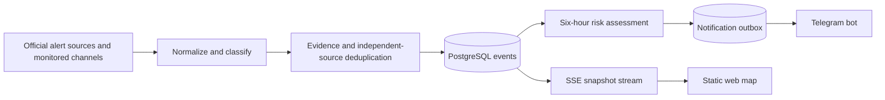

# ThreatLens UA

Evidence-first situational awareness for Ukraine: a Telegram bot, responsive static web client, PostgreSQL event history, and an explainable six-hour risk index.

> This product is not an official alert system and does not predict strike targets. During an official alert, follow the instructions of the Air Force, the State Emergency Service, and local authorities.

## What is implemented

- Three official (tier A) alert sources, per-source state reconciliation, and normalized alert periods: the Ukraine Alarm and Alerts.in.ua APIs, plus the official alert channel [@air_alert_ua](https://t.me/air_alert_ua), which needs no API token and works out of the box with the Telegram collector credentials.
- Two reconciliation models behind one aggregate: snapshot polling for the APIs, and an event-driven path for the channel, which announces raion-level alerts and all-clears one at a time and must never be read as "everything unmentioned is clear".
- Threat event classifier for UAVs, ballistic and cruise missiles, KABs, aviation, MLRS, artillery, and mortars — v2 vocabulary reading the words the channels actually use (ground-attack S-300/S-400, sea-area launches, naval drones, reconnaissance UAVs, repeat approaches, MiG-31K landings demoted to ambient), with a replayable archived corpus (`npm run classifier:replay`) and an optional model-written shadow second opinion that can never touch an event, an alert or the map.
- Evidence levels: `unverified`, `monitoring`, `confirmed`, and `official`.
- Corroboration by independent source groups; reposts do not count as independent confirmation.
- Six-hour per-location risk assessment with time decay, source-tier guardrails, validated AI output, and deterministic fallback.
- Dynamic source trust, measured nightly from the classification archive over a thirty-day window — retractions, corroboration, first reports, lag behind the leader, unreadable share — and applied as a bounded modifier (0.6–1.2) on a signal's contribution. Trust never changes a source's tier and the tier caps are applied after it; the public assessment card shows one word («довіра джерела: висока / звичайна / знижена»), the full component breakdown lives in `/ops`.
- Telegram subscriptions, commands, PostgreSQL outbox, retry policy, and delivery rate control.
- Static HTML/CSS/JS frontend with MapLibre, SSE updates, mobile and TV layouts, history, analytics, source health, and operations views.
- Per-territory map state instead of loose point markers. Every oblast, special city and raion carries
  one aggregated state — official alert, asserted threat, confirmed consequences, analytical
  assessment — computed on the server and served with the snapshot, plus a catalogue of ten
  weapon-class glyphs stacked three to a territory with a `+N` badge for the rest. A polygon is lit
  only for a territory a source named, or for the nearest territory with an outline when the named
  place has none; an icon is a claim that a weapon class is *here*, so it is emitted only where that
  claim was actually made. An oblast lit because one raion inside it was named stays muted and
  carries no icon.
- Operator-set publication mode. `live` is the default and behaves byte-identically to a build
  without the feature; `delayed_15s` holds the public presentation — snapshot, SSE stream, map, event
  rail and public attack analytics — behind a cutoff computed in PostgreSQL rather than queued in
  the process. Collection, classification, the alert reconciler, the audit tables, `/ops`, `/metrics`
  and Telegram notifications are never held. The switch, the audit trail of who changed which field,
  and a running count of events written but not yet released are all in `/ops`.
- Event-driven analytics recompute. A relevant recorded event arms a pass behind an operator-set
  debounce, bounded by a maximum delay so a continuous stream cannot postpone it forever and by a
  sixty-second minimum between completed passes so a lowered debounce cannot turn into a standing
  refresh storm. The fifteen-minute timer stays as the floor, and an «Оновити зараз» button in `/ops`
  runs one pass on demand.
- Explicit internationally recognized Ukraine boundary overlay including the Autonomous Republic of Crimea and Sevastopol; oblast/city clicks open territorial history.
- Temporarily occupied territories layer sourced from DeepStateMap, filtered by a fail-safe status allowlist and clipped to the recognized border of Ukraine. Reference context only — it never affects alerts or risk scores.
- Operator-managed catalog of recommended Telegram channels, exposed on the site and through the bot.
- Codex analytics on a ChatGPT plan, managed entirely from the operations console: an OAuth (PKCE)
  sign-in button instead of a token pasted into `.env` (session stored in PostgreSQL, refreshed
  automatically, loopback-only callback), a model picker and four per-surface switches — narrative,
  nightly digest, vector extrapolation, shadow classification — stored in `codex_settings`. The client speaks the streamed
  Responses API against `chatgpt.com/backend-api/codex` (or `chat/completions` against a compatible
  proxy), audits every call in `ai_runs`, and every surface keeps its deterministic fallback: a
  refused or expired model never breaks the flow, and model-written text is always labelled as such.
- Humanised Telegram notifications: Kyiv-time wording with a remaining-time hint instead of ISO
  timestamps, evidence levels spelled out in Ukrainian instead of database enums, a link to the
  originating channel message instead of a dead map link, and channel-text clean-up (duplicate
  punctuation, leading decorations) — with the what/where → what-to-do → details order kept
  consistent across every notification type.
- Readable threat analysis in the map's assessment details: a connected narrative of what the threat
  is, what the conclusion rests on and what would change it, signals grouped and named in Ukrainian
  with worded influence instead of raw contributions, and the raw numbers folded into a collapsed
  technical block.
- Attack analytics page: day/week/month aggregates over the classification archive — means, targets
  by territory, hours of the day, wave clustering with real message-time boundaries, repeated
  combinations and period-over-period trends — topped by a deterministic "patterns and probable
  strategy" narrative that states its open-source limits plainly.
- Automatic official KATOTTG import covering 461 cities in the 07.07.2026 release.
- PostgreSQL migrations, monthly materialized summaries, Prometheus metrics, health checks, Caddy, Docker Compose, and verified daily local backups.

## Running it

Requirements: Docker with Compose, and Node 22 only if you intend to run the tests or generate a
Telegram session outside the container.

### 1. Demo mode — one command, no credentials

```bash
cp .env.example .env
docker compose up --build -d
```

Open the port named by `HTTP_PORT` in your `.env` (default `8080`). The backend is also bound
directly on `127.0.0.1:13000`, and readiness is `/health/ready`.

This starts four containers — app, PostgreSQL, Caddy, backup — applies every migration and seeds two
clearly labelled synthetic events. Nothing external is contacted except the map basemap and the
occupied-territories layer. Use it to see the interface; it carries no real data.

### 2. Live data — Telegram credentials

Everything real arrives over MTProto, so this is the step that turns the product on. It needs a
**user** account, not a bot: the Bot API cannot read a channel it does not administer, which is what
official alert channels are.

```bash
npm install
node scripts/telegram-session.mjs
```

The script asks for `api_id` and `api_hash` from [my.telegram.org](https://my.telegram.org) →
*API development tools*, then your phone, the login code, and your two-step password if you have one.
Step-by-step for this and every other credential: [`docs/EXTERNAL_SETUP.md`](docs/EXTERNAL_SETUP.md).
It prints a `TELEGRAM_SESSION` line to paste into `.env`. That string is equivalent to being logged in
as that account — keep it out of git, revoke from *Telegram → Settings → Devices* if it leaks.

```env
TELEGRAM_API_ID=…
TELEGRAM_API_HASH=…
TELEGRAM_SESSION=…
DEMO_SOURCE_ENABLED=false
```

Restart with `docker compose up --build -d`. One session drives everything the collector reads: the
Air Force channel, every enabled official alert channel, and the OSINT monitors.

Validate in staging that the raion and hromada names those channels publish resolve against the local
catalogue. An unresolved name is reported as a catalogue gap, not a source failure, so it will not
break collection — but nothing lands on the map for it either.

### 3. The bot

Create one with [@BotFather](https://t.me/BotFather), then:

```env
TELEGRAM_BOT_TOKEN=…
TELEGRAM_BOT_USERNAME=…
```

The bot registers its own command list on start. Without a token it is skipped and everything else
keeps working.

### 4. The operator panel

`/ops`, HTTP Basic auth, credentials from `OPS_USER` and `OPS_PASSWORD`. No extra service, no
separate deployment — it is a route of the same app. In production `OPS_PASSWORD` must be at least
16 characters or the app refuses to start.

### 5. On a server

Beyond the laptop setup:

```env
SITE_ADDRESS=https://your.domain        # Caddy obtains a certificate for this name
PUBLIC_HOST=your.domain
PUBLIC_URL=https://your.domain          # must be https in production
POSTGRES_PASSWORD=<strong>
OPS_PASSWORD=<16+ chars>
METRICS_TOKEN=<16+ chars>
DEMO_SOURCE_ENABLED=false
```

Point the domain's DNS at the host and open 80 and 443 — Caddy handles certificates automatically.
Production startup **fails fast** on weak ops or metrics credentials, a non-HTTPS `PUBLIC_URL`,
demo mode left on, or development database credentials. That is deliberate: a half-configured
alerting system is worse than one that refuses to boot.

### Optional

| What | Why |
|---|---|
| `UKRAINE_ALARM_API_TOKEN` / `ALERTS_IN_UA_TOKEN` | A second independent official source. Issued on written application; corroboration, not a prerequisite. |
| `AI_BASE_URL` / `AI_API_KEY` / `AI_MODEL` | Model-written risk explanations. The deterministic engine runs without it. |
| `MAP_STYLE_URL` | Self-hosted basemap instead of the public one; see `data/map/README.md`. |
| `OCCUPATION_SOURCE_ENABLED=false` | Turn off the occupied-territories layer. |
| `PUBLICATION_DELAY_SECONDS` | How long `delayed_15s` holds the public view. Default 15, accepted range 5–60; the *mode* is an operator decision stored in the database, this is only the length. Below 5 s the hold is inside the event poll and the client's own debounce; above 60 s the client would report a deliberate hold as stale data. |
| `ANALYTICS_EVENT_DRIVEN_ENABLED=false` | Deployment-level kill switch for event-driven recompute. The worker then never subscribes to the event feed at all and only the fifteen-minute timers remain — the reason to stop it is usually a database problem, which is the worst moment to have to read a flag out of the database. |

## Telegram commands

- `/start` — create a private subscription.
- `/city` — choose a region; `/city Назва` searches the full city catalog.
- `/status` — current official alerts and public assessments.
- `/analytics` — current six-hour assessment.
- `/settings` — notification preferences.
- `/channels` — administrator-curated Telegram channels relevant to the user's subscriptions.
- `/stop` — pause notifications.
- `/delete_me` — delete Telegram profile and subscriptions.
- `/help` — safety and usage notes.

The bot does not invent an alert. Official alert state and analytical risk assessment remain separate message types.

## Data model and event flow



The map renders only an explicitly reported region, point, or direction. It does not extrapolate a target or trajectory. Assessments contain an expiry, confidence, methodology version, and supporting signals. A low score never means safety.

Detailed contracts and runbooks:

- [`docs/ARCHITECTURE.md`](docs/ARCHITECTURE.md)
- [`docs/METHODOLOGY.md`](docs/METHODOLOGY.md)
- [`docs/OPERATIONS.md`](docs/OPERATIONS.md)
- [`docs/PRIVACY.md`](docs/PRIVACY.md)
- [`docs/EXTERNAL_SETUP.md`](docs/EXTERNAL_SETUP.md)
- [`docs/COMPLETION_MATRIX.md`](docs/COMPLETION_MATRIX.md)

## Development and verification

```bash
npm install
npm run typecheck
npm run lint
npm test
npm run build
```

`npm test` runs two Vitest projects:

- `unit` — pure functions, no external services.
- `integration` — real SQL against a live PostgreSQL 18 database: subscription fanout, official alert
  reconciliation, outbox delivery and stuck-message reclaim, and the migration runner.

The integration project starts a throwaway `postgres:18-alpine` container on port `15437` and removes it
afterwards. Set `TEST_DATABASE_URL` to reuse an existing server instead (this is what CI does with a
GitHub Actions service container). Without Docker and without `TEST_DATABASE_URL` the integration tests
report as **skipped** with an explicit reason — they never pass silently. Set `REQUIRE_INTEGRATION_DB=1`
to turn that skip into a failure.

```bash
npm run test:unit
npm run test:integration
```

GitHub Actions runs typecheck, lint, both projects and the production build on every push and pull
request to `main`.

Useful endpoints:

- `/api/v1/snapshot` — atomic initial state, including the aggregated per-territory state and a
  `publication` block naming the mode, the cutoff and how far behind it is. Under `delayed_15s` every
  row in the payload is as of the cutoff rather than as of now; `publication.mode` itself is never
  held, so the page can never claim to be live while data is being held back.
- `/api/v1/stream` — real-time SSE events. Under `delayed_15s` the stream is bounded by the same
  cutoff, and `?since=` (or `Last-Event-ID`) resumes from a known version without crossing it. The
  `id:` sequence, the `connected` frame's `{at,version}` field names and the `retry: 3000` line are
  unchanged.
- `/api/v1/history` — normalized event history.
- `/api/v1/locations/:id/timeline` — alerts, threats and assessments for a clicked oblast or city.
- `/api/v1/vectors` and `/api/v1/threats/:id/vector` — the chain of **reported** observations behind a threat: which source named which place, when, and how strongly the movement between two places was attested. Not a trajectory and not a forecast; the extrapolation of a chain is operator-only and is served by neither of these endpoints.
- `/api/v1/channels` — active administrator-curated Telegram channels.
- `/api/v1/occupation` — temporarily occupied territories as GeoJSON, with source attribution, upstream revision id, per-status counts and a `stale` flag. Cached (`ETag`, `Last-Modified`, `Cache-Control: public, max-age=120`); returns an empty layer rather than an error when the source is off or unavailable.
- `/api/v1/analytics/monthly` — monthly summaries.
- `/api/v1/analytics/attacks?period=day|week|month` — aggregated attack analytics over the classification archive: message counts per threat class, per oblast and per hour of the day, activity clustered into waves, the combinations of classes that repeat across waves, the direction phrasings that recur, and a deterministic Ukrainian conclusion («Патерни та ймовірна стратегія»). Everything is aggregated in SQL, cached for two minutes (`Cache-Control: public, max-age=120`) and counted in **messages**, never in weapons; the payload never exposes a per-source or per-message row, which is what separates it from the operator-only archive endpoints below.
- `/api/v1/sources/health` — source freshness.
- `/api/v1/methodology` — machine-readable v2 methodology and hard limits.
- `/metrics` — Prometheus metrics.
- `/ops/api` and `/ops/run-assessment` — Basic-auth protected operations API.
- `/ops/api/runtime` — Basic-auth protected publication mode and recompute cadence: the stored settings, the bounds they are checked against, what the hold is doing right now (cutoff, cutoff version, held events, seconds behind), the audit trail of who changed which field, and the sentence stating what the delay does not touch. `PUT` accepts any subset of the fields; a cross-field violation is a 400 with the offending field named, never a 500.
- `/ops/api/source-trust` — Basic-auth protected dynamic source trust: every source's current score with the full methodology (weights, window, thresholds) in the payload, per-source history, and a recalculate-now POST.
- `/ops/vectors` and `/ops/threats/:id/vector-projection` — Basic-auth protected extrapolation of a reported chain, with an explicit uncertainty cone. Stored in its own tables, marked `data_nature = 'calculated'` by constraint, and unreachable from any module that builds a public response.
- `/ops` — operator login and channel catalog management; channel mutations remain Basic-auth protected.

## Backups

The `backup` service creates a PostgreSQL custom-format dump in `./backups` every 24 hours and retains 14 days by default. Change `BACKUP_INTERVAL_SECONDS` and `BACKUP_RETENTION_DAYS` as needed. For production, copy encrypted dumps to independent object storage and regularly test restoration:

```bash
pg_restore --clean --if-exists --no-owner --dbname="$DATABASE_URL" backups/threatlens-TIMESTAMP.dump
```

## Temporarily occupied territories

A separate reference layer, sourced from [DeepStateMap](https://deepstatemap.live). It is not an alert, not
a threat event and not an input to any risk score, and it is stored, served and rendered independently of
those pipelines. See [`docs/ARCHITECTURE.md`](docs/ARCHITECTURE.md) for the full contract.

| Variable | Default | Meaning |
|---|---|---|
| `OCCUPATION_SOURCE_ENABLED` | `true` | Kill switch. When `false`, nothing is fetched and `/api/v1/occupation` serves an empty layer flagged stale. |
| `DEEPSTATE_API_URL` | `https://deepstatemap.live/api/history/last` | Upstream revision endpoint. |
| `OCCUPATION_SYNC_INTERVAL_SECONDS` | `10800` | Poll interval. Values below `3600` are rejected at startup — upstream publishes roughly once a day. |
| `OCCUPATION_STALE_AFTER_SECONDS` | `21600` | How long a revision may go unconfirmed before the payload is flagged `stale`. |

### Legal framing

Occupation is a **temporary factual condition on the territory of Ukraine, not a change of border**. The
internationally recognized border of Ukraine remains authoritative throughout this product, and the
Autonomous Republic of Crimea and the city of Sevastopol are Ukraine. The layer answers "which Ukrainian
territory is currently occupied", never "where does Ukraine end".

The upstream feed is an editorial product that also covers territories russia occupies outside Ukraine —
twelve of them: Kaliningrad, Abkhazia, Karelia, Ichkeria, Petsamo, Salla, Estonia, the Pechorsky district,
Latvia, the Kuril Islands, the Tskhinvali district and Transnistria. The normalizer is therefore a
**fail-safe allowlist**: only explicitly approved status keys are rendered, and any new or unrecognized key
is rejected, counted in `threatlens_occupation_unknown_status_keys_total` and stored for review rather than
drawn on the map. Accepted polygons are then clipped to the recognized ADM0 border of Ukraine.

Clipping is the second line of defence, not the first. Transnistria's polygon overlaps the Ukrainian border
closely enough to survive geometric clipping, so the allowlist — not the clip — is what keeps it off the map.

### Data licence

DeepStateMap data is **not** published under an open licence. Attribution is emitted in every
`/api/v1/occupation` response and the source can be switched off with a single flag. The product owner runs
this project personally, and personal use requires no written permission, so the layer ships enabled. The
requirement returns on public distribution: before a public launch, obtain explicit permission from
DeepState or deploy with `OCCUPATION_SOURCE_ENABLED=false`.

## Official alerts without an API contract

Both official alert APIs require a token issued on written application. The official alert channel
[@air_alert_ua](https://t.me/air_alert_ua) carries the same executive-authority and State Emergency
Service notifications and needs no credential, so it is the source that makes official alerts work out of
the box. It is registered as a tier A official source in its own independence group — designation and
tier are what make a source official, not whether the bytes arrive over HTTPS or MTProto.

It is read with an event-driven reconciler rather than the snapshot one, because it publishes
transitions per raion rather than a national picture per poll. A message about one raion never touches
another, an explicit all-clear is not delayed by the polled-source debounce, an older message can never
override a newer one, and a missing all-clear is bounded by `ALERT_CHANNEL_MAX_ALERT_SECONDS` instead of
leaving an alert up forever. What has not changed: neither the AI engine nor OSINT channel monitoring can
start or end an official alert. See `docs/ARCHITECTURE.md`.

## Known integration boundary

Access tokens and contractual schemas for the two public alert *APIs* are not included; those adapters stay
disabled without a token and are optional corroboration rather than a prerequisite. Validate each provider
in staging; unknown locations are rejected rather than silently shown in the wrong region. See
`docs/EXTERNAL_SETUP.md` for the human-controlled launch checklist.

The location catalog is imported from the [official Ministry KATOTTG publication](https://mindev.gov.ua/diialnist/rozvytok-mistsevoho-samovriaduvannia/kodyfikator-administratyvno-terytorialnykh-odynyts-ta-terytorii-terytorialnykh-hromad), used under the Ukrainian open-data attribution terms. KATOTTG provides names and hierarchy, not map coordinates; cities without verified coordinates remain searchable and subscribable but are not placed at an approximate point.

## Capabilities, and what each one actually does

Every row is either working today or explicitly not. Nothing here is aspirational.

### Alerts — official, authoritative

| | |
|---|---|
| **What** | Air raid alert start and all-clear, per oblast and per raion. |
| **Where from** | `@air_alert_ua` (no token needed), optionally the two alert APIs, plus 21 oblast administration channels registered but **not yet routed**. |
| **How it ends** | Only an official source ends an alert. A polled source that goes quiet must stay quiet for `ALERT_END_DEBOUNCE_SECONDS` (60s = four missed polls) before the alert drops — one incomplete API response cannot produce a false all-clear. A channel source announces its all-clear explicitly and is not debounced. |
| **Failure bound** | A missing all-clear on the channel path is capped by `ALERT_CHANNEL_MAX_ALERT_SECONDS` (24h). It fires as a defect report, not as routine expiry — it is set far above any real alert on purpose. |
| **Not this** | The AI engine and OSINT monitoring **cannot** start or end an official alert, ever. That is enforced by adapter routing, by a database constraint, and by a test. |

### Threats — monitored, corroborated

| | |
|---|---|
| **What** | UAV, ballistic, cruise, KAB, aviation, MLRS, artillery, mortar. Classified from message text with locations and reported direction. |
| **Where from** | Air Force channel plus 37 monitoring channels at tiers B and C. |
| **Evidence** | `unverified` → `monitoring` → `confirmed` → `official`. Two independent source groups promote to `confirmed`. Reposts share a group, so a copy cannot confirm its original. |
| **Falling** | A source can stand down what it reported. A stand-down retracts **only that source's** claim; the event ends when nothing holds it. One channel cannot clear a threat two others still report. |
| **Not this** | No trajectory extrapolation on the public map. Only reported regions, points and directions are drawn. |

### Risk index — explainable, clamped

| | |
|---|---|
| **What** | A six-hour relative index per location and threat type, with the signals behind it. |
| **How** | Time decay with a two-hour half-life, weighted by source reliability and by measured source trust — a bounded 0.6–1.2 modifier from the nightly archive measurement; a source with no measurement contributes exactly as before. |
| **Clamps** | Only tier C sources → maximum 3.9. No tier A source → maximum 5.9. Fewer than two independent groups → confidence forced to `low`. The model cannot exceed what the sources support. |
| **Without a model** | A deterministic engine produces the same shape of output. The model is an improvement, never a dependency. |
| **Not this** | Not a probability. The indicative percentage is a scale reading. A low score never means safe. |

### Map

| | |
|---|---|
| **State polygons** | Oblasts and all 136 raions fill by four independent state families — official alert, asserted threat, confirmed consequences, analytical contour — driven by feature-state rather than regenerated geometry. Raions appear from zoom 6.0 and take over at 6.8. |
| **Per-territory aggregated state** | The snapshot carries one entry per oblast, special city and raion: its alerts, its threats by weapon class with evidence and reported direction, its strongest assessment, and the ranked icon stack. Coverage is stated rather than implied — `direct` (a source named this territory), `unmapped` (a source named a place inside it that has no outline of its own, so no finer layer will ever supersede this one) and `partial` (an ancestor of a named territory that does have its own outline, drawn muted). A national-scope warning produces no territory at all: it is a caption, an event card and a bot message, never 27 lit oblasts. |
| **Icon catalogue** | Ten weapon-class glyphs in four tones — consequence, confirmed, reported, analytic — ranked by danger, evidence, relation and freshness; three slots per territory and a `+N` badge for what ranking cut. The stack is a small point source that is re-emitted when it changes, kept separate from the polygon layers so the feature-state claim above stays true of the fills. Icons are never arrows and never a route. |
| **Sovereignty** | The internationally recognized border renders above every fill; Crimea and Sevastopol are Ukraine and labelled as such. |
| **Occupation** | A separate reference layer under the border. Temporary factual condition, never a change of border. |
| **Boundaries** | Raion geometry built from OpenStreetMap, matched to the catalogue by KATOTTG code, simplified per shared way so neighbours cannot develop gaps. 1.05 MB, 0.31 MB gzipped. |
| **Screen readers** | A polite live region beside the map names up to eight territories with their icon stacks in Ukrainian, and says «Показано 8 територій із N» when there are more. With no icons anywhere on the map it falls back to naming the territories under an official alert. The map is a summary, not the record: the «Активні події» rail beside it lists every alert, threat and assessment as ordinary focusable text and is the canonical surface. |

### Bot

Nine commands, all implemented: `/start`, `/city`, `/status`, `/analytics`, `/settings`, `/channels`,
`/stop`, `/delete_me`, `/help`. Delivery uses a PostgreSQL outbox with idempotency keys, retry with
backoff, Telegram `retry_after`, automatic disabling of blocked users, and reclaim of messages stuck
mid-send. Standing a threat down sends nothing rather than re-sending the original warning text — a
message that reads as an all-clear must come from an official source.

Repeats are suppressed one layer above the outbox. `notification_state` records what each chat was
last *told* about each threat and each (location, threat type) assessment, so a source re-confirming
a standing threat produces nothing: a message goes out only for a new threat, a raised evidence
level, a changed threat type or geography, or a validity window pushed more than twenty minutes
further out — and that last case edits the message the subscriber is already looking at instead of
pushing a new one. Updates say what moved (`⬆️ Доказовість підвищено…`, `⏱ Загрозу продовжено до
04:10`) rather than restating the warning. Analytics adds hysteresis on top: a new message on a level
change or a full point of index movement, with a thirty-minute floor per location and chat that only
a level increase bypasses, and de-escalations delivered silently. Official alerts and the nightly
digest are exempt from all of it.

The bot is also exempt from the publication delay, and structurally so: delivery reads the event log
through its own durable cursor in `worker_state`, a different consumer from the one the public stream
uses, so a hold placed on the presentation cannot reach it even by accident. That is the intended
answer and not an oversight. The recipient of a push asked to be warned; every part of this design
exists to get the warning to the person under it, and holding an alert back from them for fifteen
seconds would buy nothing and invert the one trade-off the alert model is built on.

### Analysis archive

Every classification decision is stored, including the decisions to raise nothing and why, stamped
with the classifier version. Without that stamp, a change in our own rules is indistinguishable from
a change in enemy tactics. Three queries ship in `docs/OPERATIONS.md`: events by type and oblast over
time, **where threats are lost** (last asserted vs. withdrawn, with elapsed time), and what each
source published that raised nothing.

The archive is also what the classifier is tested against and what source trust is measured from.
`npm run classifier:replay` classifies the stored corpus with today's rules and reports what moved —
by class, by location, and by whether a message raises anything at all, split by direction. The
shadow classifier, when its `/ops` switch is on, writes a model's second opinion beside each archived
decision with an `agrees` flag; its product is a reading list of disagreements, never a change to
state. And the nightly trust run reads the same archive to score every source's last thirty days.

## Roadmap

### In progress

| | State |
|---|---|
| **Routing for 21 official oblast channels** | Registered in the database, inert. Alert routing reads one channel from configuration rather than the catalogue, and the parser does not yet handle their word order (`🔴 <район> - повітряна тривога!` versus `🔴 13:47 Повітряна тривога в <район>`). |
| **Analytics endpoints** | Archive schema and queries exist, and the public attack-analytics page now reads them (`/api/v1/analytics/attacks`, day/week/month, waves and trends). Remaining: operator-facing slices beyond the coverage view. |
| **Threat vectors** | Chains of *reported* movement, public. Extrapolation computed but exposed only under `/ops`, stored separately so it cannot leak into a public response. |

### Next

| | Why it matters |
|---|---|
| **Operator panel: source management** | 58 sources exist, 24 deliberately disabled, and the panel cannot show or toggle any of them — it manages the user-facing recommendation list instead. It also has no view of catalogue gaps, stuck alerts, withdrawals, or which source is holding an alert open. |
| **Conditional forward warning** | The nightly digest is unconditional and fixed at 23:20. A warning issued *because* a threat is building — for the coming evening or day — does not exist yet. |
| **Model-based classification** | Classification is still deterministic rules (v2). But the two prerequisites now exist: the archive is a replayable labelled corpus (`npm run classifier:replay`), and shadow mode records a model's verdict beside every rules verdict with an agreement flag. What remains is accumulating enough disagreement data and a deliberate decision to promote — the model still cannot touch an event, an alert or the map. |
| **Russian-language sources** | Three registered channels stay disabled because the classifier and the location catalogue are Ukrainian-only. |
| **Delivery rate governor** | Burst coalescing is per source. During a mass attack across 46 subscriptions, aggregate fan-out is unreviewed. |

### Known limits

- Single application replica. Schedulers share database cursors; horizontal scaling needs advisory-lock leadership first.
- `sources.enabled` does not gate the two polled API adapters — they check only for a token.
- Alerts at hromada level resolve to the parent raion; the catalogue has no hromada tier.
- Abbreviated administrative forms (`р-н`, `обл.`) resolve to the namesake city rather than the district.
- The map's live region is built from the icon stacks, and an official alert on its own produces no
  icon. A territory whose only state is an alert therefore contributes no sentence to it while any
  icon exists elsewhere on the map; the alert-only fallback applies when the map carries no icons at
  all. Nothing is lost — the «Активні події» rail lists every alert as text and is the canonical
  screen-reader surface — but the live region is a summary of the map, not of the situation.
- A threat reported only for a raion carries no icon below zoom 6.8. The raion stack appears only
  once the raion layer is readable, and the oblast above it is `partial` coverage, which is
  deliberately never given an icon. Below that zoom the threat is a muted oblast fill, an event card
  and a territory panel — visible, but not as a weapon-class glyph.
