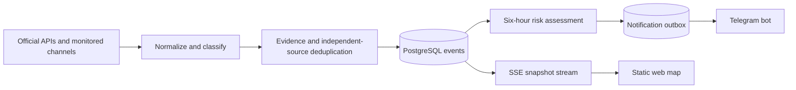

# ThreatLens UA

Evidence-first situational awareness for Ukraine: a Telegram bot, responsive static web client, PostgreSQL event history, and an explainable six-hour risk index.

> This product is not an official alert system and does not predict strike targets. During an official alert, follow the instructions of the Air Force, the State Emergency Service, and local authorities.

## What is implemented

- Two official alert adapters, per-source state reconciliation, and normalized alert periods.
- Threat event classifier for UAVs, ballistic and cruise missiles, KABs, aviation, MLRS, artillery, and mortars.
- Evidence levels: `unverified`, `monitoring`, `confirmed`, and `official`.
- Corroboration by independent source groups; reposts do not count as independent confirmation.
- Six-hour per-location risk assessment with time decay, source-tier guardrails, validated AI output, and deterministic fallback.
- Telegram subscriptions, commands, PostgreSQL outbox, retry policy, and delivery rate control.
- Static HTML/CSS/JS frontend with MapLibre, SSE updates, mobile and TV layouts, history, analytics, source health, and operations views.
- Explicit internationally recognized Ukraine boundary overlay including the Autonomous Republic of Crimea and Sevastopol; oblast/city clicks open territorial history.
- Operator-managed catalog of recommended Telegram channels, exposed on the site and through the bot.
- Automatic official KATOTTG import covering 461 cities in the 07.07.2026 release.
- PostgreSQL migrations, monthly materialized summaries, Prometheus metrics, health checks, Caddy, Docker Compose, and verified daily local backups.

## Quick start

```bash
cp .env.example .env
docker compose up --build -d
```

Open `http://localhost:8080`. The backend is also bound to `http://127.0.0.1:13000` for local development. Readiness is available at `/health/ready`.

The default configuration starts in demo mode with two clearly marked synthetic events. Before public deployment:

1. Set strong `POSTGRES_PASSWORD` and `OPS_PASSWORD` values.
2. Configure `PUBLIC_URL`, `PUBLIC_HOST`, and an HTTPS `SITE_ADDRESS`.
3. Set `DEMO_SOURCE_ENABLED=false`.
4. Add the official alert API token and validate its location mapping against the provider's current schema.
5. Add `TELEGRAM_BOT_TOKEN` and `TELEGRAM_BOT_USERNAME`; configure the MTProto collector for the Air Force channel.
6. Configure an OpenAI-compatible structured-output endpoint if AI assessments are required.
7. Point `MAP_STYLE_URL` to a self-hosted style/PMTiles package; see `data/map/README.md`.

## Telegram commands

- `/start` — create a private subscription.
- `/city` — choose a region; `/city Назва` searches the full city catalog.
- `/status` — current official alerts and public assessments.
- `/analytics` — current six-hour assessment.
- `/settings` — notification preferences.
- `/channels` — administrator-curated Telegram channels relevant to the user's subscriptions.
- `/stop` — pause notifications.
- `/delete_me` — delete Telegram profile and subscriptions.
- `/help` — safety and usage notes.

The bot does not invent an alert. Official alert state and analytical risk assessment remain separate message types.

## Data model and event flow



The map renders only an explicitly reported region, point, or direction. It does not extrapolate a target or trajectory. Assessments contain an expiry, confidence, methodology version, and supporting signals. A low score never means safety.

Detailed contracts and runbooks:

- [`docs/ARCHITECTURE.md`](docs/ARCHITECTURE.md)
- [`docs/METHODOLOGY.md`](docs/METHODOLOGY.md)
- [`docs/OPERATIONS.md`](docs/OPERATIONS.md)
- [`docs/PRIVACY.md`](docs/PRIVACY.md)
- [`docs/EXTERNAL_SETUP.md`](docs/EXTERNAL_SETUP.md)
- [`docs/COMPLETION_MATRIX.md`](docs/COMPLETION_MATRIX.md)

## Development and verification

```bash
npm install
npm run typecheck
npm test
npm run build
```

Useful endpoints:

- `/api/v1/snapshot` — atomic initial state.
- `/api/v1/stream` — real-time SSE events.
- `/api/v1/history` — normalized event history.
- `/api/v1/locations/:id/timeline` — alerts, threats and assessments for a clicked oblast or city.
- `/api/v1/channels` — active administrator-curated Telegram channels.
- `/api/v1/analytics/monthly` — monthly summaries.
- `/api/v1/sources/health` — source freshness.
- `/api/v1/methodology` — machine-readable v2 methodology and hard limits.
- `/metrics` — Prometheus metrics.
- `/ops/api` and `/ops/run-assessment` — Basic-auth protected operations API.
- `/ops` — operator login and channel catalog management; channel mutations remain Basic-auth protected.

## Backups

The `backup` service creates a PostgreSQL custom-format dump in `./backups` every 24 hours and retains 14 days by default. Change `BACKUP_INTERVAL_SECONDS` and `BACKUP_RETENTION_DAYS` as needed. For production, copy encrypted dumps to independent object storage and regularly test restoration:

```bash
pg_restore --clean --if-exists --no-owner --dbname="$DATABASE_URL" backups/threatlens-TIMESTAMP.dump
```

## Known integration boundary

Access tokens and contractual schemas for public alert providers are not included. Adapters stay disabled without a token. Validate each provider in staging; unknown locations are rejected rather than silently shown in the wrong region. See `docs/EXTERNAL_SETUP.md` for the human-controlled launch checklist.

The location catalog is imported from the [official Ministry KATOTTG publication](https://mindev.gov.ua/diialnist/rozvytok-mistsevoho-samovriaduvannia/kodyfikator-administratyvno-terytorialnykh-odynyts-ta-terytorii-terytorialnykh-hromad), used under the Ukrainian open-data attribution terms. KATOTTG provides names and hierarchy, not map coordinates; cities without verified coordinates remain searchable and subscribable but are not placed at an approximate point.
