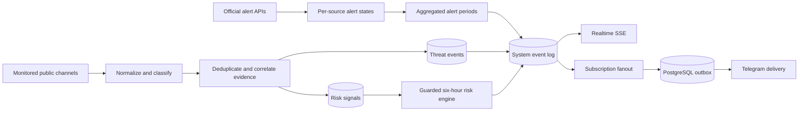

# Architecture

ThreatLens UA is an evidence-processing system, not a strike-prediction system.

## Runtime components

- `app`: Fastify API, static web assets, schedulers, classifier, risk engine, Telegram bot and delivery workers.
- `postgres`: authoritative event store, subscription store, outbox and reporting database.
- `caddy`: public TLS termination, compression and security headers.
- `backup`: daily verified custom-format PostgreSQL archives.

## Information domains

1. **Official alert** — a state aggregated from configured official alert APIs. AI and Telegram monitoring cannot start or end it.
2. **Threat event** — a normalized public message with time, validity, provenance, geography and evidence level.
3. **Risk assessment** — a six-hour relative index derived from time-decayed signals. It is neither an official alert nor a statistical strike probability.

## Event flow

## Consistency rules

- Alert sources have independent state rows. A global alert ends only when no configured source still reports it active.
- Reposts from the same `independence_group` count as one source.
- Two independent Tier A/B groups may promote an event to `confirmed`.
- Evidence never downgrades when a weaker message is merged into an event.
- Source edits create revisions; a replacement event corrects the previous event instead of silently deleting it.
- Threat events expire after their explicit validity window and remain in history.
- Notification fanout and delivery are separate, idempotent steps.
- City/oblast subscriptions match in both directions through the location hierarchy.

## Scale boundary

The initial deployment is intentionally a single application replica because scheduled workers share database cursors. PostgreSQL row locks make outbox delivery safe, but multi-replica scheduler leadership should use advisory locks before horizontal scaling.
