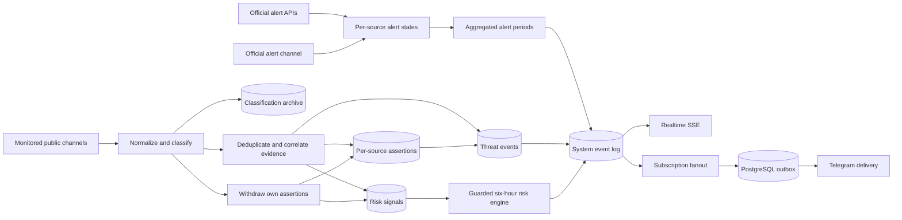
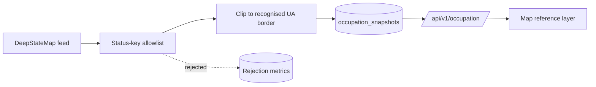

# Architecture

ThreatLens UA is an evidence-processing system, not a strike-prediction system.

## Runtime components

- `app`: Fastify API, static web assets, schedulers, classifier, risk engine, Telegram bot and delivery workers.
- `postgres`: authoritative event store, subscription store, outbox and reporting database.
- `caddy`: public TLS termination, compression and security headers.
- `backup`: daily verified custom-format PostgreSQL archives.

## Information domains

1. **Official alert** — a state aggregated from the configured official alert sources. What makes a
   source official is its designation and tier, not its transport: an alert authority publishing over
   its own Telegram channel is the same authority publishing over HTTPS. AI and OSINT channel
   monitoring still cannot start or end an official alert — only a designated official source can,
   and only for the locations it names.
2. **Threat event** — a normalized public message with time, validity, provenance, geography and evidence level.
3. **Risk assessment** — a six-hour relative index derived from time-decayed signals. It is neither an official alert nor a statistical strike probability.
4. **Occupation layer** — reference context describing which parts of Ukraine are temporarily occupied. It is not an alert, not a threat event and not an input to any risk score.

The fourth domain is deliberately isolated. Occupied-territory geometry never reaches the classifier, the
risk engine, the alert reconciler or the notification fanout; it is stored in its own table
(`occupation_snapshots`), served by its own endpoint (`/api/v1/occupation`) and rendered as its own map
layer. Nothing in the alert or assessment pipeline reads it, and switching the source off with
`OCCUPATION_SOURCE_ENABLED=false` degrades the map to an empty layer without changing any other behaviour.

### Legal framing of the occupation layer

Occupation is a temporary factual condition on the territory of Ukraine. It is not a change of border.
The internationally recognised border of Ukraine remains the authoritative geography of this product,
and the Autonomous Republic of Crimea and the city of Sevastopol are Ukraine. The layer answers
"which Ukrainian territory is currently under occupation", never "where does Ukraine end".

### Fail-safe allowlist

The upstream DeepStateMap feed is an editorial product covering more than the Ukrainian front line. It
also carries polygons for territories russia occupies **outside** Ukraine — twelve of them at the time of
writing: Kaliningrad (`prussia`), Abkhazia, Karelia, Ichkeria, Petsamo, Salla, Estonia, the Pechorsky
district, Latvia, the Kuril Islands, the Tskhinvali district and Transnistria. Rendering the feed as-is
would paint "occupied" polygons across the Baltics, Finland, Georgia, Moldova and Japan on a map that
claims to show Ukraine.

The normalizer is therefore an allowlist, not a blocklist:

- Only status keys on an explicit approved list are ever emitted. Everything else is dropped.
- A **new, unrecognised** status key is dropped as well. It increments
  `threatlens_occupation_unknown_status_keys_total`, is stored in `occupation_snapshots.unknown_status_keys`
  for review, and is never rendered. An upstream vocabulary change makes the layer smaller, never wrong.
- The twelve non-Ukrainian keys are additionally named in `NON_UKRAINIAN_STATUS_KEYS` so the intent is
  documented, testable and visible in the rejection metrics rather than folded into "unknown key".
- Surviving polygons are then clipped to the internationally recognised ADM0 border of Ukraine.

Clipping is the **second** line of defence, not the first. Transnistria is the reason: its polygon overlaps
the Ukrainian border closely enough that a meaningful sliver survives geometric clipping. The allowlist is
what actually keeps it off the map. Any future review must treat the allowlist as the primary control and
the border clip as backup.

### Data licence

DeepStateMap data is not published under an open licence. Attribution is mandatory and is carried in every
`/api/v1/occupation` response. The source is switchable off with a single environment flag. **Open
question:** terms of use for a public deployment have not been agreed with DeepState. The product owner
must obtain explicit permission before a public launch, or run with `OCCUPATION_SOURCE_ENABLED=false`.

### Official sources, and what "official" is not

Two of the official (tier A) sources are APIs — Ukraine Alarm and Alerts.in.ua — and both need a
token issued on written application. The rest are Telegram alert channels, which carry the same
executive-authority and State Emergency Service notifications and need no credential at all: the
national [@air_alert_ua](https://t.me/air_alert_ua) plus the oblast and city military
administrations registered by `migrations/013_source_catalog_expansion.sql`.

Which of those channels is actually read is data, not code. Every row with
`adapter_type='mtproto_alert_channel'` and `enabled=true` is subscribed to and may start and end
alert periods; twenty-one bodies are registered and the rest are switched off. `enabled` on these
rows means one specific thing — **the parser has been shown this channel's published wording, as a
fixture, in `src/domain/alert-parser.test.ts`** — and not "this body is trustworthy", which is what
`tier` and `official` say. Three registered administrations publish real alerts and are switched off
anyway because their format cannot be read safely; `migrations/014_multi_channel_alert_routing.sql`
carries the verbatim samples and the reasoning. `ALERT_CHANNEL_ENABLED` is the deployment-level kill
switch above all of them, the same shape as `OSINT_MONITOR_ENABLED`, and nothing in the application
writes `sources.enabled` for this adapter type.

The distinction that matters is **designation**, not transport. A tier A source designated to publish
alerts starts and ends official alerts whether its bytes arrive over HTTPS or MTProto. What has not
changed, and is not negotiable:

- The AI assessment engine cannot start, end or extend an official alert. It reads them.
- OSINT channel monitoring — the Air Force channel, and anything added beside it — cannot start or
  end an official alert either. It produces threat events and risk signals, which are a different
  information domain with different wording in the UI and the bot.
- A source can only move the alert state of the locations it explicitly names.

The national channel is registered in its own `independence_group` (`official-air-alert-channel`),
separate from `air-force` and from the API group, and each administration carries its own. Note for
anyone reading corroboration counts: the national channel is independent of the *Air Force* channel
in publisher and mandate, but it shares upstream authorities with the civil alert APIs and with the
administrations that feed it, so two-group agreement inside the official family is weaker evidence
than agreement between an official source and an OSINT group. Where two rows are one authority
speaking twice — an administration and the personal channel of the person who heads it — they share
a group so a repost cannot corroborate itself.

### The community mirror

One official-family source is neither an API with a contract nor a body with a mandate:
[ubilling.net.ua/aerialalerts](https://ubilling.net.ua/aerialalerts/), registered by
`migrations/027_aerial_alert_mirror.sql` as `aerial-alerts-mirror` and polled on the same
fifteen-second snapshot path as the two APIs. It republishes the same executive-authority air-raid
state for free, with no key and no application. It exists in the catalogue because it is the only
HTTPS alert source this deployment can read while both API applications are pending, and it is
registered `enabled=true` because a source that carries the live picture and is switched off carries
nothing.

It is where **designation, not transport** stops being comfortable. The state it carries is the
authorities' own declaration; the publisher relaying it has no mandate at all. The row follows the
state — `tier='A'`, `official=true` — because its only function is to move official alert periods,
and a row wired into the snapshot reconciler but labelled Tier B would misdescribe what the system
does with it. The contrary reading is recorded in the migration header rather than argued away, and
the columns are inert on this path: the reconciler is keyed on `source_id` and reads neither.
**The catalogue decision is the product owner's**, who asked for the source.

Two caveats travel with it, and both are stronger than the national channel's:

- **Corroboration with it is worth almost nothing.** `?source=default` is an aggregator over five
  upstreams — `skog`, `klimenko`, `jaam`, `aiu`, `ual` — serving whichever is most current, and the
  last two *are* Alerts.in.ua and Ukraine Alarm. On any given poll this row may be one of the other
  two API rows wearing a different hat. Hence `independence_group='community-alert-mirror'`, shared
  with nothing: the group is not a claim of independence, it is a refusal to pool the mirror with
  `official-civil-alerts` and let one upstream corroborate itself. Agreement between the mirror and
  an OSINT group still means something; agreement between the mirror and the APIs may be one fact
  counted twice.
- **Its operator disclaims it.** "Do not perceive this API as absolutely reliable … use official
  sources of information."

#### Granularity: what the mirror is actually read at

The mirror serves two bodies and the adapter reads the finer one.

| | request | shape | granularity |
|---|---|---|---|
| primary | `?source=ual&raw` | `{source, cachedat, raw:[…]}` — Ukraine Alarm's own payload inside the mirror's envelope | `State`, `District`, `Community` |
| fallback | bare URL | `{source, cachedat, states:{…}}` — the aggregator's own digest | 25 oblast rows |

`?source=<x>&raw` is a documented passthrough
([wiki](https://wiki.ubilling.net.ua/doku.php?id=aerialalertsapi)): the mirror hands back the chosen
upstream's native body unchanged. `ual` is Ukraine Alarm, and it is the only probed upstream that
publishes below oblast level — `klimenko` serves the envelope with an empty district list, `jaam`
returns `[]`, `aiu` rate-limits readily. One live poll measured 3 `State` + 26 `District` + 5
`Community` entries while the aggregated feed, polled 26 seconds later, had nine oblasts and nothing
finer.

The three levels reach the catalogue through resolution that already existed, which is why this was
an adapter change and not a schema one:

- `State` → oblast, by name, exactly as before. Two `State` entries are not oblasts: «Автономна
  Республіка Крим», which the aggregated feed carries **no row for in any state**, and «м. Харків та
  Харківська територіальна громада», which the resolver's compound narrowing lands on the city.
- `District` → raion. «Харківський район» is a rank-0 hit on the raion's own `name_uk` under the
  literal-first lookup added when the aggregated feed was resolving «Донецька область» to Донецьк.
- `Community` → **raion**, through the hromada aliases `raionAliases` writes onto every raion row.
  The catalogue is deliberately three-tier, so «Вовчанська територіальна громада» resolves to
  Чугуївський район, which contains it. Where two raions hold hromadas of the same name — Покровська
  exists on both Донеччина and Дніпропетровщина — the alias is ambiguous, `pickLocationMatch` refuses
  to guess, and the label lands in the unresolved-location report. Raising the wrong raion is worse
  than raising none.

Two labels therefore routinely name one catalogue row, and both shapes were present in a single
capture: a District and a Community inside it (Чугуївський + Вовчанська), and two Communities of one
raion. `persistOfficialAlertSnapshot` folds after resolution — a location holds if **any** row
holding it says so, and its period starts at the **earliest** of their starts, so the timestamp does
not depend on the order the upstream happened to list two labels in.

**Alert types.** The `ual` payload carries Ukraine Alarm's whole vocabulary; `AIR`, `ARTILLERY` and
`URBAN_FIGHTS` were all observed in one capture (`CHEMICAL`, `NUCLEAR`, `INFO` exist in the same
enum). This source moves `air_raid` and nothing else, so only `AIR` is read and every other type is
dropped — including when it is the *only* thing a region has, which is why three shelled
Dnipropetrovshchyna hromadas are absent from that capture's output. They are not under an air-raid
alert, and rendering a shelling warning as a siren would misstate what was declared.

**Region ids are not forwarded.** Ukraine Alarm's `regionId` is a small integer in its own namespace
("16", "1313"); `resolveLocationId` probes `id OR official_code` first, where a collision would be a
silent mis-resolution rather than an error. Names only.

`AERIAL_MIRROR_RAW_SOURCE=''` turns the passthrough off and restores oblast-only behaviour exactly
as this source shipped — a full retreat to a known-good path if the upstream ever reshapes its body,
not a degradation. It is a string and not a boolean so a different upstream can be named instead.

#### Quiet, or broken? The rule for an empty raw feed

The raw feed lists only what is alight, so "nothing alight" is an empty list — and an empty list is
what a calm night looks like **and** what a half-dead upstream looks like: `cachedat` fresh, envelope
intact, `raw` empty because whatever fills it has stopped. Refusing it would put the source into
`error` every time the country was at peace, which is wrong and would train an operator to ignore the
health card. Believing it would clear every raion the mirror holds.

Nothing inside the payload separates the two, so the rule reaches outside it: **when the raw feed
reports no air-raid region, ask the aggregated feed before believing it.** That feed is a different
upstream inside the same mirror, and it is enough to answer the only question being asked — is
anything alight anywhere?

- aggregated feed also reports nothing → the country is quiet. The empty snapshot is accepted and
  the mirror clears normally, through the end debounce as always.
- aggregated feed reports at least one oblast → the raw feed is not describing the present. **Fall
  back** to the aggregated body for this poll, at oblast granularity, under the same `source_id`, and
  log it. Degraded resolution beats a wrong all-clear.
- aggregated feed cannot be read either → **hold.** `markSourceError`, `alert_source_states` never
  opened. Two unreadable feeds are not evidence of peace.

The same fallback carries a raw payload the parser refused outright — stale, future, non-array,
entries it cannot read, HTTP failure. There the aggregated feed is a substitute rather than a
witness, but the ordering and the both-fail outcome are identical, so it is one path. Falling back is
the adapter working rather than failing, so the source stays `current`; the signal is the log line
and `threatlens_aerial_mirror_polls_total{mode="unified_fallback"}`, and a fallback rate that stops
being ~zero means the map has quietly gone back to oblast-only.

One consequence of switching granularity mid-stream is worth naming: the two feeds address different
rows, so a poll that falls back stops re-stating the raions the previous poll raised, and they enter
the end debounce while the oblast above them is raised. For up to `ALERT_END_DEBOUNCE_SECONDS` both
are held. That is the over-warning direction and it is left alone — the alternative, letting a
fallback poll clear rows it has no opinion about, is the direction §Consistency rules calls
unrecoverable.

**Request budget.** The mirror publishes two requests per second per host. The steady state is **one**
request per poll — the cross-check runs only when the raw feed found nothing or was refused. The two
are sequenced with `AERIAL_MIRROR_REQUEST_GAP_MS` (600 by default) between them and never issued
together: during research two requests inside one second were answered with a truncated body, which
is the precise failure the parsers exist to refuse.

#### The stale-freeze rule

A snapshot source is authoritative about what it *stops* reporting — that is what makes the
reconciler able to clear a location. A mirror has a failure mode the APIs do not: it can keep
answering `200` with a structurally perfect body long after the process feeding it has died. Every
region then reads `alertnow: false`, and running that snapshot publishes «Офіційний відбій» for the
entire country during an attack — the direction §Consistency rules calls unrecoverable.

So freshness is checked **before** anything is persisted. The feed stamps every response with its own
`cachedat`; past `AERIAL_MIRROR_STALE_SECONDS` (300 by default) the poll is refused, becomes
`markSourceError`, and `alert_source_states` is never opened. A frozen mirror therefore **holds** its
alerts rather than clearing them, and the operator sees an unhealthy source instead of a quiet map.
The same refusal covers a missing, unreadable or *future* `cachedat` — the feed prints bare
Europe/Kyiv wall clocks with no zone, so a naive parse in a UTC container reads every stamp three
hours into the future and would make the staleness test unfailable.

The gate is one function shared by both parsers, because the surest way to keep two copies of a
safety rule in agreement is not to have two copies. It applies to the mirror's **envelope** only:
`cachedat` is a bare Kyiv wall clock, while every `lastUpdate` inside the `ual` passthrough is honest
ISO-8601 with a `Z`, and running the wall-clock reader over an instant that already carries its zone
would shift every alert start by two or three hours. The gate also outranks the quiet reading above:
an empty `raw` list under a stale stamp is refused as stale, never considered as peace.

Two consequences are deliberate and are the operator's to weigh, not the code's:

- A mirror that freezes while holding alerts holds them until it recovers. There is no sweeper —
  `expireStuckAlertChannelAlerts` is scoped to `mtproto_alert_channel` rows — so over-warning is the
  chosen failure direction and releasing a permanently dead mirror's holds is a documented manual
  action in [`docs/OPERATIONS.md`](OPERATIONS.md).
- Nothing detects stale *alert state* served under a fresh `cachedat`. It is indistinguishable from a
  genuinely quiet country, and the end-debounce plus the two-source aggregate are the only defences
  left. It is the strongest argument for not running the mirror as the sole alert source.

### Event-driven official alert source

The APIs return the complete national picture on every poll, so their reconciler is a snapshot: it
clears everything the source held, re-raises what the response reports, and lets the aggregate decide.
A channel is not a snapshot. It publishes transitions — "Повітряна тривога в Нікопольський район",
"Бериславський район - повітряна тривога!" — and a message about one raion says nothing whatsoever
about any other. Running it through the snapshot reconciler would clear the whole country every time
one oblast was mentioned.

It therefore has its own path, in the same module and sharing the same aggregate reconciler:

- 🔴 raises exactly the source-state rows it names; 🟢 lowers exactly the rows it names; every other
  row of that source is untouched.
- **Every function on this path takes its source id from the caller.** `alert_source_states` is keyed
  on `(source_id, location_id, alert_type)`, so several administrations holding an alert over the
  same raion at once is the storage model working as intended: each owns its own row, `bool_or`
  decides what the map shows, and one body's all-clear can never end another body's alert.
- Two published word orders are read, both pinned as verbatim fixtures. The national channel writes
  the phrase first (`🔴 13:47 Повітряна тривога в <район>`, with an optional `•` list); the
  administrations write the location first (`🔴 <район> - повітряна тривога!`) with no printed clock.
- Only "Повітряна тривога" and "Відбій (повітряної) тривоги" move alert state. Other traffic — 🟠
  advisories, 🔴🔴 heightened-danger notices, the "Загроза …"/"Відбій загрози …" family — is recorded
  but never acted on, because "Відбій загрози ударних БпЛА" is a threat standing down inside an alert
  that is still running. In the location-first order the literal "повітрян…" before "тривог…" is
  mandatory: it is what stops "<район> - відбій загрози БпЛА!" from reading as an all-clear now that
  the phrase no longer has to sit at the start of the headline.
- A 🟡 partial all-clear subtracts the locations the same message repeats under "тривога ще триває у"
  (national) or "повітряна тривога досі триває у" (administrations). When nothing survives the
  subtraction, nothing is cleared.
- **The addendum is not what makes a message an all-clear.** The national channel attaches the same
  "тривога ще триває у:" list to its per-oblast threat commentary, where a 🟠 "КАБ напрямок
  Краматорськ" is answered by a 🟡 stand-down whose headline is whatever the duty officer typed —
  "Відбій по кабам", "Відбій", "к", "е" were all published under #Донецька_область over
  07.08–09.08.2026, each over an identical list of all eight raions of the oblast. A bare "Відбій"
  is therefore the elided member of the "Відбій <загрози|атаки|по …>" family, and the archive proves
  it: after the bare "🟡 20:53 Відбій" of 08.08 the alert ran ten more hours and ended, with no 🔴 in
  between, as "🟢 06:45 Відбій тривоги в" over a • list. Those headlines are ignored, and a bare
  "Відбій" arriving *without* the addendum stays `unrecognized` rather than being read as a full
  all-clear. Both are pinned as fixtures.
- An administration also publishes ordinary news, and about a third of those posts mention
  "повітряної тривоги" in passing. A message with no status circle **and** no alert phrase in its
  headline is filed as `ignored: 'unrelated'`; anything carrying a circle, or an alert phrase without
  a circle, is still `unrecognized` and logged at warn level. That split is what keeps the
  wording-drift alarm a signal instead of a permanent stream of school-bus announcements.
- `ALERT_END_DEBOUNCE_SECONDS` is **not** inherited. That window exists for polled sources that go
  quiet about an alert they were holding; it is keyed on `alert_source_states.missing_since`, which
  the event path always leaves NULL. An explicit all-clear is a statement, not a silence.
- Message ordering is not trusted. The clock printed in the message body (`12:29`) carries no date and
  no timezone and is never used; the Telegram publication time is. `alert_source_states.last_event_at`
  records the newest message applied to each row and an older event is refused, so an all-clear that
  arrives late after a reconnect cannot take a newer alert off the map.
- An edit is re-processed with the **original** publication time. The corrected text is what matters;
  timing it at the edit would let a correction to an hours-old message restart an alert. A location
  dropped by an edit is not cleared — absence never ends an alert on this path.
- On connect the collector re-reads a bounded window of each channel's history
  (`ALERT_CHANNEL_BACKFILL_MESSAGES`, `ALERT_CHANNEL_BACKFILL_SECONDS`). The window is folded to one
  terminal state per location before anything is written, so an alert that both started and ended
  while the collector was down produces no notification at all — only what is still true now reaches
  the reconciler. The message count is a per-channel *ceiling*: history is read a page at a time and
  the read stops as soon as it runs past the age bound. 300 messages is roughly the six-hour window
  of the busiest channel (~50 messages an hour); an administration publishes one to three an hour and
  finishes in one page, so enabling more channels costs round trips proportional to what each one
  actually published rather than a flat multiple.

The failure mode this model has and the snapshot model does not is a missing all-clear: a 🟢 that is
never delivered, or that arrives in a shape the parser does not recognise, would leave an alert
active forever. `ALERT_CHANNEL_MAX_ALERT_SECONDS` bounds it. The bound is deliberately far longer
than any real alert (default 24 hours, floor 1 hour) because clearing a *live* alert early is the one
failure this system treats as unrecoverable; when it fires it is a defect signal, logged at warn level
and counted in `threatlens_alert_channel_stuck_alerts_total`, not routine behaviour. The sweep covers
**every** alert-channel row, including the ones `enabled=false` switches off: disabling a channel
stops it being read, it does not withdraw what it was holding, and those rows would otherwise pin
their locations on the map with no collector left that could clear them.

Names the channel publishes are raion- and hromada-level and are resolved through the same catalogue
lookup as the API adapters, with its two guarantees intact: LIKE metacharacters are escaped, and an
ambiguous tier is refused rather than resolved to an arbitrary row. A name that resolves to nothing is
a catalogue gap, not a source outage — it is counted and logged, never marked as a source error.

### Threat de-escalation: who still says a threat is happening

A threat event used to fade on one mechanism only — a 30-minute validity timer that every new
observation pushed forward. A channel publishing "ТУшки неактивні, у наш бік наразі нічого не летить"
or "Полтавщина — відбій загрози ударних БпЛА" was recognised, stored and then ignored.

The state model is now the same one the official alert domain already uses. `alert_source_states`
holds one row per (source, location, alert type) and the aggregate is `bool_or(holds)`;
`threat_assertions` holds one row per (event, source, location, threat class) and a threat event
lives while any of its assertions still holds. Having one way to reason about "who still says this
is true" across both domains is the point of the shape.

- **A withdrawal reaches only its own publisher.** Every retraction is `WHERE source_id = <the
  withdrawing source>`, enforced in SQL in one place. One channel — or one joke the classifier reads
  wrongly — can never clear a threat two other channels are still reporting, and a source that never
  asserted matches no rows and therefore changes nothing. That is a consequence of the key, not a
  check that could be forgotten.
- **Scoping is by publisher, not by independence group.** A repost aggregator shares its group with
  the channel it copies (`osint-vanek-nikolaev` / `air-force`), and an all-clear from the copy must
  not retract the original's reporting.
- **`coverage: 'unspecified'`** — a withdrawal that names no place — closes *every* open claim of
  that one source. The classifier deliberately refuses to guess a scope from the text, and no scope
  is invented downstream either; what bounds the blast radius is the publisher, not the wording.
- **A redirect asserts and withdraws in one message.** "Балістика повз Полтаву на Харків" opens a
  claim over the place being approached and closes this source's claim over the place being passed,
  in one transaction. A place the message reports as a *direction* is never withdrawn by it.
- **Validity is never shortened below what the survivors support.** When an assertion is withdrawn,
  `threat_events.valid_until` is recomputed as the maximum over the assertions that still hold, so a
  source taking its claim back cannot cut short a window another source is still vouching for.
- **Risk signals decay; they are never negated.** A withdrawal pulls `risk_signals.expires_at` back
  to now for that source's signals over the same places and classes. A negative contribution could
  drive a location's index to zero while a real threat from other sources is still running; expiry
  says only "the basis for this signal is gone" and leaves the time decay to do the rest. The rows
  stay in place and auditable.
- **Evidence does not move.** An event that loses its last assertion becomes `status='withdrawn'`
  with its `evidence_level` unchanged, and `event_updates` records
  `new_evidence_level = previous_evidence_level`. State and evidence are different axes: a threat two
  independent monitors confirmed remains a confirmed threat in the record after both stood it down.
  A `threat.withdrawn` row is appended to `system_event_log` so the map and SSE see the transition.
- **Nothing here can produce an official all-clear.** No path from the classifier reaches
  `alert_source_states` or `alert_periods`, and the integration suite asserts that directly rather
  than inferring it from the routing code.

### Reading a place name out of free text

The alert channels publish a location as a label and it is looked up whole. The OSINT monitors write
prose, and Ukrainian declines every place name in it, so the classifier has to recognise "Києвом",
"Фастова" and "Білої Церкви" as the rows the catalogue spells "Київ", "Фастів" and "Біла Церква".

Until `v4` it did that by looking for the name as a **substring** of the message. A substring has no
word boundary on either side, and the failure mode is not a near miss: "Бар" is inside "Баришівку",
"Обухів" inside "Обухівку", "Березне" inside "Березну", "Самар" inside "Самарському", "Чоп" inside
"Чоповичі", "Приморськ" inside "Приморськ-Ахтарська" — each one a **different real settlement**
published on the map and pushed to that settlement's subscribers. "південно-західний" resolved as the
town of Південне: a compass bearing turned into a place.

`v4` matches whole words instead. The message is cut into tokens, each catalogue name is cut into
tokens, and a name matches only where every one of its words equals a message word modulo declension.
The declension itself is a generated, closed table (`src/domain/place-morphology.ts`): a paradigm is
picked by the shape of the nominative and produces an enumerated set of forms, which is what keeps
"Березну" out of "Березне" — the neuter adjectival paradigm has no `-у` form at all — where a
symmetric stemmer could not, since both words stem to "березн". Nothing consults a dictionary, a
model or the network; `place-morphology.test.ts` prints the table the rules generate so a reviewer can
read what they claim.

Four rules ride on top of it, and each answers a case the archive actually contains:

- **An oblast adjective is not its city.** "Київської області" names `ua-32` and never `ua-80`,
  because "київ" is not a word-for-word match for "київської". A bare feminine oblast adjective does
  name the oblast ("чернігівська реактивні ще"); a bare **masculine raion** adjective does not,
  because it collides head-on with a settlement — "БпЛА над Кропивницьким" is the city — so the raion
  needs its head noun ("Кропивницькому районі"). One head noun licenses a coordinated list:
  "Київської та Чернігівської областей" names both.
- **A span two catalogue rows spell the same is refused**, the same rule the alert-channel lookup
  applies, unless something ranks them: administrative rank first, then the oblast the message itself
  already named ("Одещина: … на Південне" picks the Odesa one of the two), then whether the row is a
  hand-seeded first-order settlement — coordinates are set on the oblasts, the special cities and the
  seeded capitals and on nothing the importer writes, which is what keeps a bare "Миколаїв" the oblast
  capital. Городок, two KATOTTG rows in two oblasts nobody named, stays refused.
- **A declined compass word is a bearing, never a place**, and so is a short list of ordinary words a
  generated paradigm can reach. Both apply only to a form the message *declined*: a message that
  spells the name exactly as the catalogue does is taken at its word, so "2 реактивних Мена" is the
  town and "мені" is not.
- **A longer name takes the text it covers**, so a shorter one survives only where it occurs outside
  every longer match.

Migration 024 landed with it: eighteen settlements the channels name and the importer does not read
(it imports KATOTTG cities, not the 29 000 villages), the Kyiv districts Троєщина and Жуляни as
aliases of the city, and "запоріжжя" removed from the oblast's aliases so a bare "Запоріжжя" names the
city exactly as a bare "Київ" already did.

### Retrospection: reading the tense, not just the vocabulary (`v5`)

Everything up to `v4` read a message for the words in it and nothing at all for the *tense* it was
written in. On 2026-08-09 at 08:25Z the єРадар channel published a reflective essay — «Цієї ночі
тисячі киян знову ночували на платформах метро… Раніше масовані нальоти БпЛА… давали бодай якийсь
час на підготовку. Тепер усе інакше.» — which contains `баліст`, `БПЛА`, `ракети` and `Києва`, so the
classifier opened a live «Київ — комбінована загроза» and notified subscribers. The Air Force's 09:00
morning tally and the strategic-aviation channel's after-action write-ups fail identically, and both
had been sitting in the gold corpus as labelled false positives for two versions.

`assessRetrospective` in `src/domain/classifier.ts` reads the register in three bands:

- **Summary bulletins** — «підсумки», «у ніч на 08 серпня», «за ніч», «за попередніми даними»,
  «збито/подавлено», «вчора», «минулої доби», «починаючи з 13:00» — are decisive on their own.
- **Narration** — «цієї ночі» beside a past-tense verb, the «раніше … тепер» contrast, and prose at
  essay length (≥ 400 characters, ≥ 3 sentences, mean sentence ≥ 45 characters, *and* a past-tense
  verb somewhere) — is decisive only when nothing operational is present.
- **Operational NOW-markers** override everything. A stated course, an arrow bulletin, «загроза
  застосування», a time-to-impact, the telegraphic «3х» count, a shelter instruction and a
  present-tense verb of motion are **strong**: a message carrying any of them publishes exactly as it
  did in `v4`, however much it also narrates. «зараз», «триває», «у повітряному просторі», «пуски» and
  «увага» are **weak**: narration beside one of those is the grey band.

The asymmetry is the whole safety argument, and it is enforced structurally as well as stated: the
veto is applied *last*, and only to a classification `significanceRejection` has already passed. It
can therefore convert would-publish into archive-only and do nothing else — it cannot create an
assertion, widen one, turn a withdrawal back into a threat, or touch a message the pipeline was
already discarding. Refused messages archive as `decision = 'ignored_retrospective'` with the markers
that fired in `indicators`, so the refusal is legible from the row alone; the class survives in
`candidate_threat_types` and the locations are deliberately **not** recorded, because a place a
message asserts nothing about does not belong in the location analytics.

Two markers were considered and rejected after a full `v4 → v5` replay over the production archive,
and both rejections are pinned as tests. «станом на 00:42» is not a marker of anything: the
strategic-aviation channel opens its *live* hourly snapshots with it, and reading it as a summary
would have suppressed three live warnings for Zhytomyr and Kharkiv. Essay shape alone is not a marker
either: an intelligence *forecast* («Потенційні цілі ураження: Київ: Дарниця, Жуляни… Коли саме буде
здійснено атаку нам невідомо») has exactly that shape and is prospective, so the essay rule
additionally requires a past-tense verb. The replay over 918 archived decisions moved four messages,
all four hand-reviewed retrospectives, and made none newly significant.

**The grey-band gate.** With the `retrospective_gate` switch on in `/ops` (migration 025, off by
default), a message the rules mark `suspect` gets one narrow question put to a model before the event
is ingested: is this current, or retrospective? This is the only place in the system where a model's
answer changes what the pipeline does, and the authority is bounded in one direction only. It is
reached from exactly one call site and only for a `suspect` classification, which the rules set only
on a message that was about to become an event; the result type admits `archive` from a single branch
reached only when the model affirms «retrospective» with confidence ≥ 0.7; and every other path —
switched off, over budget, no session, transport failure, timeout, prose where JSON was asked for, an
answer of «current» — returns `publish`. A model that is broken, slow, absent or hostile can lose a
*suppression* and can never lose a *warning*.

It is synchronous, inside `classifyAndIngest`, after burst coalescing and before `ingestThreat`, with
a hard `RETROSPECTIVE_GATE_TIMEOUT_MS` (default 2500 ms) and a rolling per-minute budget
(`RETROSPECTIVE_GATE_MAX_PER_MINUTE`, default 6). It is not inside the ingestion *transaction*, so a
slow model holds no connection and no row lock. Post-publication withdrawal was rejected outright:
§Consistency rules already treats a published fact that later vanishes as unrecoverable, and a threat
that reaches the map and a subscriber's Telegram and then disappears teaches that subscriber the app
guesses. Gating only the notification leg was rejected too — it would split one fact into two truths
and leave the map and the bot disagreeing for as long as the model took. The call goes through the
one Codex client, so it is audited in `ai_runs` under `surface = 'retrospective_gate'`,
`prompt_version = 'retrospective-gate-v1'`. A suppression it produces archives as
`decision = 'ignored_retrospective_model'`, kept apart from the deterministic word because a replay
reproduces the first and can never reproduce the second.

### Classification archive

`source_messages` keeps the raw text and one `processing_status` word; everything the classifier
concluded was computed in memory and discarded, so "why was this message ignored?" had no answer.
`message_classifications` now records one row per decision — including the decisions to do nothing —
with the candidate threat classes, the indicators that fired, the resolved locations and their
relation types, the national-scope flag, the resulting event, and, for a withdrawal, what it took
back and what the source last claimed before it.

`classifier_version` (`CLASSIFIER_VERSION` in `src/domain/classifier.ts`) is mandatory on every row
and is the reason the archive is worth keeping. Without it an improvement to this project's own rules
is indistinguishable from a change in enemy behaviour: both look like "fewer ballistic events this
month". Raise it whenever a rule changes what a message means. `UNIQUE (source_message_id,
classifier_version)` makes a replay of the same version a no-op while letting a new version's verdict
land beside the old one, which turns stored history into a golden corpus for regression-testing the
next classifier.

The archive write happens outside the ingestion transaction and its failure is a counter
(`threatlens_classification_log_failures_total`), never an exception. During a mass attack the thing
that must keep working is the map; an analytics row is not worth a dropped threat event.

**Replaying the corpus.** `npm run classifier:replay` reads the archived decisions, classifies the
stored `source_messages` with the rules as they are now, and reports what moved on three axes: the
threat class, the resolved locations, and whether the message raises anything at all. The last one is
split by direction, because "37 messages that used to be ignored now raise an event" and "37 events
that used to be raised are now silent" are opposite findings. `--dry` is the default and writes
nothing; `--write` records the fresh verdicts beside the old ones under the current version, which is
what the `UNIQUE` constraint above was built for. The diff itself lives in
`src/domain/classifier-replay.ts` and is unit-tested without a database, because a broken diff would
report a clean replay for a change that broke everything.

**Shadow classification.** With the `shadow` switch on in `/ops`, a model reads the same message
*after* the deterministic decision has been made and archived, and its verdict is written to
`shadow_classifications` beside the rules' verdict with an `agrees` flag. The call goes through the
one Codex client like every other, so it is audited in `ai_runs` under `shadow-classifier-v1`. It runs
outside the ingestion transaction on a promise nobody waits for, every failure is silence, and there
is no code path by which its answer can reach an event, an alert or the map —
`src/services/shadow-classifier.ts` returns void to the pipeline by design. Its product is a reading
list: `/ops` shows the agreement rate over the last day and the newest disagreements, and the action
that follows is a human writing a pattern and a test. Calls are capped at
`SHADOW_CLASSIFIER_MAX_PER_MINUTE` (default 6) and messages over budget are dropped rather than
queued.

**Measured quality.** Agreement with a model is not accuracy — two readers can be wrong together, and
the model has never seen the conventions these channels write in. `tests/fixtures/classifier-gold.json`
is the answer: 191 real archived messages, each read and labelled by hand, with the labelling date,
method and conventions in the file's own header. `src/domain/classifier-gold.test.ts` scores the
current rules against it on the same three axes the replay compares and asserts each number as a
**floor**, so a future edit that quietly loses recall fails in CI rather than on somebody's phone at
three in the morning. `v5` measures significance P=100% / R=90.4%, threat-class accuracy 100% over
the messages both sides call significant, and locations P=99.6% / R=93.1%. (`v4` measured
significance P=98.4% / R=90.4% and locations P=97.2% / R=93.1%; `v3` measured P=97.2% / R=88.8% and
P=R=89.4%.) What `v5` moved is precision alone, through the two retrospective false positives `v4`
left — recall is unchanged and must be, because the veto is only allowed to subtract.

The fixture separates two things that used to be one number. `assertsThreat` is the reviewer's
reading of the text; `significant` additionally requires that the place named exists in the location
catalogue. Twenty-one of the 191 were correct reports about settlements the catalogue did not hold —
Згурівка, Велика Димерка, Троєщина, Жуляни — and those are a coverage problem for the location
importer, not a rules problem. Counting them as classifier misses would blame the regexes and hide
the real cause. Migration 024 added eighteen of those settlements and the two Kyiv districts, so the
corpus's own labels moved with the catalogue: those places are now ids in `gold.locations` rather
than names in `outsideCatalogue`, and one message is left in the gap column.

**Watching it in production.** `threatlens_classifications_total{version,decision}` carries the
classifier version, so a version bump appears on the dashboard as one series ending and another
beginning instead of as an unexplained shift in the decision mix.
`threatlens_classification_rejections_total{source,reason}` splits the two reasons a message raises
nothing, which are fixed in different files: `no_threat_recognised` concentrated on one channel means
its vocabulary drifted away from `src/domain/classifier.ts`, `no_location` means the catalogue is
missing its settlements. `threatlens_threat_to_de_escalation_total{source,version}` counts only the
withdrawals that actually ended a live event — the dangerous direction, and the one a rule change
must never start producing quietly. `threatlens_shadow_attempts_total` and
`threatlens_shadow_outcomes_total{status,reason}` give shadow coverage as a query
(`outcomes{status="recorded"} / classifications_total`) rather than as a gauge, because a ratio
computed inside one process cannot be aggregated across restarts and a counter divided at query time
can. `threatlens_retrospective_gate_attempts_total` counts messages that entered the grey band —
which says whether the band is drawn in the right place, independently of whether a model was ever
asked — and `threatlens_retrospective_gate_outcomes_total{verdict,reason}` carries both, so
"publications that happened because the model could not be reached" is a label selector rather than a
join.

### Attack analytics over the archive

`src/services/attack-analytics.ts` reads the classification archive back out as a public page: for
a day, a week or a month it aggregates means, territories, hours of the day and period-over-period
trends in SQL, clusters messages into waves — with the gap measured between actual message times,
not bucket edges, so the wave count cannot depend on the resolution the reader picked — and writes
a deterministic "patterns and probable strategy" conclusion in the same voice as the narrative
service. `GET /api/v1/analytics/attacks` is public, cached, and validates its period against a
whitelist; the page states plainly that it reads open sources and is neither a forecast nor an
official record. When the previous period is empty the prose says there is no baseline instead of
claiming a comparison it does not have.

### Dynamic source trust

`sources.tier` says what a channel is *allowed* to be — it is written by hand in a migration and by
nothing else, and the risk caps stand on it. `src/services/source-trust.ts` measures something
different: how a publisher has actually behaved over the last thirty days, recomputed once a day from
the classification archive and appended to `source_trust` (one row per source per run, so "what did
we think of this channel then" always has an answer; `source_trust_current` is the newest row).

Five metrics, each decay-weighted with a ten-day half-life so last night's retraction outweighs one
from four weeks ago: the share of assertions later withdrawn (the heaviest term), the share of events
another *independence group* also asserted, first reports (leadership is decided per group and then
across groups, so a repost aggregator can never be its group's earliest voice), the median lag behind
the first reporter over the events it did not lead, and the share of messages the classifier could
not read (mostly a parser defect metric, so it carries the smallest weight). Below twenty observed
events the source keeps the neutral 0.5 and its metrics are recorded but not scored.

The score is consumed in exactly one place: `src/services/risk.ts` multiplies a signal's effective
contribution by a modifier bounded to **[0.6, 1.2]**. The bounds are the design. A source with no
trust row arrives as NULL through a LEFT JOIN and contributes exactly as it did before the feature
existed, so a failed nightly run degrades to "no change", not to "everything is suspect". At the
floor a distrusted source still contributes 60% — a channel that has been wrong before is not a
channel that is wrong now, and silencing it would let a threat reported only by an imperfect source
disappear from the map. Four guardrails, each pinned by `src/services/source-trust.test.ts`:

- **Trust does not change tier.** Nothing in the module writes `sources`, and the 3.9/5.9 caps run
  *after* the modifier, so no amount of good behaviour turns a C into an A.
- **Official sources never fall below neutral.** A mandated body that had a bad month is still the
  body with the mandate; demoting it is an editorial decision about its catalogue row, not a silent
  nightly computation.
- **A repost is not a first report** — structurally, by the group-then-source leadership order.
- **Old observations weigh less**, on the same decay curve shape the risk engine uses for freshness.

Every run is stamped with `TRUST_METHODOLOGY_VERSION`, the same contract `classifier_version` has in
the archive: a step in a source's series must be attributable to us rather than to the channel.
Nothing here calls a model and nothing here is published raw. The public assessment card carries one
word per source («довіра джерела: висока / звичайна / знижена», thresholds 0.65 / 0.40, worded by
`trustLabel` on the server so every surface shares one boundary) with the number folded into the
collapsed technical block; `/api/v1/methodology` publishes the modifier bounds; and the full
component breakdown, per-source history and a recalculate-now button live behind `/ops`
(`src/api/ops-source-trust-routes.ts`), with the methodology carried in the payload beside the rows —
a trust score without its weights and window is a number an operator can only accept or reject.

### One model client, one audit trail

Everything that reaches a language model goes through `src/services/codex-client.ts`. The client
holds the only copy of the transport decision — the streamed Responses API against
`chatgpt.com/backend-api/codex`, `chat/completions` against anything else, `CODEX_API_STYLE` to
overrule the URL — and the only copy of the audit write: every call, including the pre-flight
refusals that never left the process, lands in `ai_runs` with its prompt, output, duration and
failure reason. The token goes into one `Authorization` header and nowhere else. Which surfaces may
call at all — narrative, nightly digest, vector extrapolation, shadow classification — is stored in
`codex_settings` and switched from `/ops`; every surface is complete without a model, so a dead session degrades to the
deterministic text rather than to an error, and model-written prose is always labelled.

The commitment stated at the top of this document and on the map itself — the system shows an
explicitly reported region, point or direction and never a predicted target, impact or trajectory —
is unchanged. Threat vectors are two different things wearing one name, and the whole design is about
keeping them apart.

**The public chain** is a sequence of *reported observations*: "three sources led this target from
Sumy through Poltava to Kharkiv over eight minutes". It is derived, never stored: every fact it is
made of already lives in `message_classifications` and `message_classification_locations`, so the
chain cannot disagree with the messages it summarises and a classifier fix retroactively corrects
every chain it touched. Each leg is graded by what was actually said, and the payload never flattens
the three rungs into one line:

| Basis | What a single message stated | Where it comes from |
| --- | --- | --- |
| `reported_transit` | the movement itself — "Балістика повз Полтаву на Харків" | a `redirect`: one message retracts the place being passed and asserts the place being approached |
| `reported_direction` | a heading out of a named place, not an arrival | `relation_type='reported_direction'` beside an anchor location |
| `observation_sequence` | **nothing** — two separate messages named two places at two times | consecutive classifications on the same event |

The weakest rung is the one that could be mistaken for a trajectory, so it is labelled as such in the
payload (`basis`, `basisLabel`), drawn as a dotted line rather than a solid one, and described in the
map legend as "порядок наш; рух не стверджувало жодне джерело". Legs whose ends have no coordinate
stay in the payload as stated facts with `drawable: false` — raions carry no KATOTTG coordinate, so
the chain falls back to the centroid of their ADM2 polygon and publishes that as
`coordinateSource: 'raion_centroid'`, `coordinatePrecision: 'approximate'`, rendered as a hollow node.

**The extrapolation** — continue the last leg, name the locations inside the resulting cone, state the
uncertainty — is an operator tool and is isolated the way the occupation layer is isolated, only more
strictly, because this one would be actively harmful if published:

- separate storage: `ops_threat_vector_projections` and `ops_threat_vector_projection_candidates`,
  never a column on `threat_events`, so no `SELECT e.*` in a public query can pick it up;
- separate service (`src/services/vector-projection.ts`) and separate plugin
  (`src/api/ops-vector-routes.ts`) behind the same Basic auth as the rest of `/ops`;
- the import arrow points one way: the ops service imports the public chain builder, and no module
  that builds a public response imports the ops service, at any depth;
- `data_nature` is `CHECK (data_nature = 'calculated')` on the projection row *and* on every candidate
  row, so "this is arithmetic, not an observation" is a property of the data rather than of a caption;
- `confidence` is `CHECK (confidence IN ('low','medium'))`. High confidence in an extrapolation of two
  reported points is not a value this schema can hold.

`src/api/vector-isolation.test.ts` walks the real module graph from every public entry point and
fails the build if any of them reaches the ops modules, and separately fails if the `ops_`-prefixed
table names appear in a public module or in the browser bundle.
`tests/integration/threat-vector.test.ts` plants a marker inside a stored projection and then reads
the snapshot, the threat list and detail, the history, the location timeline, both public vector
endpoints and a live SSE connection including its replay backfill, asserting none of them contains it.

The vector itself is computed deterministically — bearing, ground speed, horizon, cone half-angle,
uncertainty radius and candidate ranking involve no network call. A configured model is offered the
finished numbers and may only return a better Ukrainian phrasing; the reply is schema-validated and
rejected outright if it contains a single number the computation did not produce, and
`narrative_origin` records whether an operator is reading the model's wording or the generated one.

### Publication mode: one cutoff, computed in PostgreSQL

An operator may hold the public presentation back by `PUBLICATION_DELAY_SECONDS` by switching
`runtime_settings.publication_mode` from `live` to `delayed_15s` in `/ops`. The mode is data, the
length is configuration, and the two are deliberately separate: a staging deployment proves the
mechanism at five seconds without a code change, and the decision to hold anything at all is never
buried in `.env`.

The hold is a **bound on the SELECT**, never a queue in the process. `src/services/publication.ts`
derives one `PublicationSlice { mode, delaySeconds, cutoffAt, cutoffVersion, lastPublishedEventAt,
headVersion }` from `system_event_log` in a single statement, and `src/api/server.ts` threads it
through every public read inside one request, so the rows, the `version` and the `generatedAt` a reader is
served all describe the same instant. A queue would be lost on restart, would double-deliver against
the reconnect backfill, and would have to be re-sorted after a mode change; a bound cannot be lost,
replayed or re-ordered, because `system_event_log` remains the only state.

Four properties hold the design together:

- **The cutoff is `GREATEST(now() - delaySeconds, mode_changed_at)`.** Without the clamp, flipping
  `live → delayed_15s` would move the cutoff fifteen seconds into the past and retract rows that were
  already published — an early all-clear read from the other direction, which is the one failure this
  system treats as unrecoverable. `mode_changed_at` is a column, not an in-process variable, so a
  restart during a flip does not lose it.
- **The stream is bounded by a releasable head version, not by a per-row predicate.** The hub emits
  `WHERE version > cursor AND version <= head`. A per-row `created_at` filter would let the cursor
  advance past a row that was not yet releasable and drop it permanently.
- **`live` is byte-identical to a build without the feature.** `delaySeconds = 0` makes
  `cutoffAt = now()` and `cutoffVersion = max(version)`, every added predicate degenerates to the
  predicate that was already in the tree, and every `CASE` is a no-op. That is what makes the feature
  safe to ship with the switch off.
- **Status is reported as of the cutoff.** In `delayed_15s`, `src/repositories/events.ts` returns
  rows whose *current* status is terminal but which were live at the cutoff, projecting the label
  back and keeping the raw value in a second column no public surface reads. Otherwise «відкликано»
  would appear beside an orange «активна загроза» polygon, and a terminal state revealed before the
  frame that carries it is an early all-clear.

Two limits are known and deliberate rather than latent. A `status` or `evidence_level` **upgrade** on
an event that is already past the cutoff is not held — the predicates bound when a row became
visible, not every later revision of it — so a threat can be promoted to `confirmed` in the public
view before the fifteen seconds are up. And a district attached to an already-published event by a
later merge **is** held for the full cutoff (`threat_event_locations.created_at`), because under the
territory model that district is a polygon and an icon stack, which is the most perceivable output
the map has.

**The Telegram fan-out is exempt, by mechanism.** `src/bot/outbox.ts` reads `system_event_log`
through its own durable cursor in `worker_state('notification-fanout')`; it is a separate consumer
from `eventHub`, so a gate placed in the stream cannot reach it even by accident and the exemption
costs no code. It is also exempt by intent, twice over. The roadmap enumerates the delayed set
exhaustively — «публічні snapshot, SSE, карта, панель подій і аналітика» — and a push notification is
in none of it. And the recipient of a push is a subscriber who asked to be warned, not a reader of a
public map: every part of the alert design exists to get the warning to the person under it, and
holding an `alert.started` push for fifteen seconds would invert that trade for no benefit at all.

Nothing else in the write path is held either: collection, classification, `alert_source_states`,
`alert_periods`, `message_classifications`, `threat_assertions`, `shadow_classifications`, `ai_runs`,
every `/ops/*` route, `/metrics` and `/health/*` run at wall clock in both modes. The operator-facing
sentence says exactly that, and it is stored beside the switch rather than only in this document,
because the person flipping it is not reading `docs/ARCHITECTURE.md` at that moment.

### The territory aggregate

The map used to draw threats and assessments as point markers over polygons that only ever carried
alert state. `src/domain/territory-state.ts` replaces that with one aggregated state per territory:
for every oblast, special city and raion referenced by the current slice, its alerts, its threats
folded by weapon class with evidence level and reported direction, its strongest assessment, and a
ranked icon stack. It is a pure fold over rows the snapshot already fetched plus one bounded ancestry
query — no new SQL over `threat_event_locations`, no clock of its own (`now` is a required argument,
so two calls over the same rows produce byte-identical output).

Coverage is stated rather than implied, per state family independently:

| Coverage | What it means |
| --- | --- |
| `direct` | a source literally named this territory, or the catalogue resolved a named place to it |
| `unmapped` | this is the nearest territory *with an outline* above a named place that has none — a city or hromada. It is drawn, because no finer layer will ever supersede it |
| `partial` | this territory is an ancestor of a named territory that has its own outline. Derived coverage of an explicitly named child: carried in the payload, written into the browser's feature-state, and named by the territory panel — but drawn by nothing. The child has its own polygon and is lit at every zoom, so lighting the ancestor too would assert the whole |

The browser mirrors that table in paint. `web/app.js` writes all twelve feature-state keys in
one pass (`territoryStateOf`), and the four `*Partial` keys have no reader among the paint
expressions by design: an oblast whose raions are alerted gets neither fill nor outline, and
`alertLabelCollection()` does not even emit a label feature for it — a label at opacity zero would
still take a slot in the symbol collision grid and push a real raion name off the map. Raion layers
carry no `minzoom` and no zoom-interpolated state opacity in any of the four families. Zoom moves
line widths, label sizes and the neutral raion grid; it does not move what is asserted. The one
surviving threshold is `ICON_TIER_ZOOM` (6.8), which switches icon stacks between oblast and raion
anchors — see «What the map asserts» in `docs/METHODOLOGY.md` for why the glyph keeps a tier the
polygon does not.

An **icon** is a stronger statement than a polygon: a glyph says a weapon class is *here*, a fill
says "this territory, or somewhere inside it that has no outline". The difference is the whole
no-invented-geography rule, so icons are
emitted only for `direct` and `unmapped` territories and are additionally withheld in three cases.
A location whose relation is `mentioned` or `official_alert` produces a panel row and no icon —
`relationFor()` assigns `mentioned` to transit («повз Миколаїв») and as the fall-through for any
alias in the text, and a weapon glyph on that would be a claim the source never made. An analytic
assessment becomes an icon only at `significant` or above, while the analytic *contour* keeps the
lower `elevated` floor. And an analytic `(threatType, riskLevel)` pair carried by more than twenty
territories in one snapshot produces no icons at all: a national-scope classification is fanned out
to every oblast as `national_posture` risk signals, and twenty-seven grey glyphs would be geography
invented from a warning nobody localised.

Nothing in this module reads the database, `src/config.ts` or `pg`, and nothing downstream reads it
back: the aggregate is a presentation of numbers the risk engine has already computed, and feeding it
into the engine would count the same reports twice.

## Event flow

### Catch-up backfill for classifier sources

After a restart or a long disconnect the collector resumes at the live edge of every channel: whatever
was published while the process was down is never read. `src/services/source-backfill.ts` closes that
gap for the classifier sources — the OSINT monitors and the Air Force channel — and it is a second,
separate loop from the alert-channel reconnect read in `src/sources/telegram.ts`. The separation is
structural: the service consumes a `BackfillPort` whose `routes()` yields classifier routes only, it
imports nothing from `teleproto` or the collector, and every database statement it runs is additionally
scoped to `adapter_type IN ('mtproto','mtproto_monitor')`. `ALERT_CHANNEL_BACKFILL_*` is untouched.
The two loops cannot share an implementation, because an alert channel publishes *states* that fold to
one terminal value per location, and a monitoring channel publishes *events* that fold to nothing.

**The cursor is derived, never stored.** It is `max(published_at)` over `source_messages` for that
source, served by `source_messages_source_published_idx`. The hot path therefore gains zero writes, a
message that threw is not marked as done, and a rerun of a window that already landed computes an
empty replay set before a single history request is made. `source_backfill_state` keeps a copy of the
cursor and the per-source progress for `/ops` and for audit, and is never read back as an input to the
decision. A source with an empty archive measures its gap from `baseline_at`, written the first time
it is seen, so registering a channel can never trigger a read back to the beginning of time.

**The gap decision** is `gap = now - cursor`, compared against `CLASSIFIER_BACKFILL_MIN_GAP_SECONDS`
(3600) with `<=` — sixty minutes exactly is not more than sixty minutes. The window is
`[max(cursor, now - MAX_AGE_SECONDS), now]`, paged newest-first, bounded by message count and page
count, and replayed **in chronological order** so an all-clear can never be applied before the alert
it cancels. Hitting a bound is `truncated`, which is a bounded success and not a failure. One source
failing raises `consecutive_failures`, which lengthens its own quiet period exponentially
(`MIN_RERUN_SECONDS · min(2^n, 24)`) and stops nothing else; `markSourceError` is deliberately not
called, because live collection for that channel is unaffected.

**Stale history is archive, not news, and the seam is `system_event_log`.** A replayed message carries
`historical: true` into `ingestThreat`, which computes `outsideWindow = publishedAt + 30 min <= now()`
per message. Outside the window the event is created `expired` with `ended_at = valid_until`, no new
district is attached to a live event, no risk signal is written, no corroboration promotion and no
supersession run, and — the load-bearing one — nothing is appended to `system_event_log`. That row is
the only trigger the public SSE stream and the Telegram fan-out have, so withholding it suppresses the
map and the notification at once, in one place. Inside the window nothing changes at all: the
ten-minute-old post at the recent end of a three-hour gap is published exactly as it would have been
live. A retraction is never suppressed — a publisher's own all-clear is the safety-positive direction —
and it is bounded instead by `asserted_at <= <the all-clear's own publication time>`.

The occupation layer has its own flow and does not join the one above:

## Consistency rules

- Alert sources have independent state rows. A global alert ends only when no configured source still
  **holds** it, and a *polled* source holds an alert while it reports it *and* for
  `ALERT_END_DEBOUNCE_SECONDS` after it stops. A source that publishes an explicit all-clear stops
  holding the alert the moment that all-clear lands; the window is for silence, not for statements.
  Providers are polled every 15 seconds, so a single incomplete response or one failed
  call can no longer produce an "Офіційний відбій"; the alert ends on the first poll after the window
  elapses. The asymmetry is deliberate: a delayed all-clear is recoverable, a false one is not. The
  debounce is an additional condition, not a replacement — one source going quiet still cannot end an
  alert another source is reporting. A provider that stops answering altogether therefore holds its
  alerts open indefinitely; that boundary and its operator response are documented in
  docs/OPERATIONS.md.
- An alert period is unique per (location, alert type, start timestamp). A provider that ends an alert
  and later re-reports it with the identical start timestamp reopens that period instead of inserting a
  colliding one, so one location's history can never abort the snapshot — and therefore the
  reconciliation of every other location in the same poll.
- An event-driven alert source moves only the locations a message explicitly names, and only through
  the two phrases that mean an alert transition. Absence is never an all-clear, an older message never
  overrides a newer one, and a missing all-clear is bounded by `ALERT_CHANNEL_MAX_ALERT_SECONDS`
  rather than left open forever.
- Reposts from the same `independence_group` count as one source.
- Two independent Tier A/B groups may promote an event to `confirmed`.
- Evidence never downgrades when a weaker message is merged into an event.
- A source withdraws only its own assertions. A threat event ends as `withdrawn` when its last
  holding assertion is taken back, and its validity is never shortened below what the remaining
  sources still support. A source that never asserted cannot withdraw anything. A withdrawal is also
  bounded in time: it reaches only the assertions that were standing, and the risk signals that had
  been observed, at the moment it was published, and an assertion published *before* a stand-down can
  never clear the `withdrawn_at` that stand-down wrote.
- A message may never move an event's observation window backwards. `last_observed_at` and
  `valid_until` are maxima, and the summary and direction text are rewritten only by a message at
  least as new as the one they came from. Out-of-order arrival is the normal case for a catch-up
  backfill and a routine one for a live reconnect, and before this rule a late message could retire a
  live threat early or replace its prose with an older sentence.
- A message outside its own validity window never appends to `system_event_log`. It is archived with
  its original publication time, its provenance and its classification, and it is unreachable from the
  public map, the SSE stream and the notification fan-out — because that one row is the only thing
  either of them reads. The window is checked per message, so a replayed gap publishes its recent end
  and archives its stale tail. Nothing about a live message's handling changes: the rule applies only
  to a message the caller declares historical.
- Withdrawal decays that source's risk signals by expiry, never by a negative contribution, and never
  changes an event's evidence level.
- OSINT withdrawal has no access to official alert state. `alert_source_states` and `alert_periods`
  are unreachable from the classifier path in either direction.
- Every classifier decision is archived with the classifier version that made it, so a change in this
  project's rules stays distinguishable from a change in enemy behaviour.
- Measured source trust modulates a signal's contribution within [0.6, 1.2] and does nothing else: it
  never changes a source's tier, the tier caps are applied after it, an unmeasured source contributes
  unchanged, and an official source is never scored below neutral.
- Source edits create revisions; a replacement event corrects the previous event instead of silently deleting it.
- Threat events expire after their explicit validity window and remain in history.
- Notification fanout and delivery are separate, idempotent steps.
- City/oblast subscriptions match in both directions through the location hierarchy. The match walks exactly
  one `parent_id` edge, which covers the shipped two-level catalogue (oblast/special city -> city); inserting
  a raion or hromada tier between them would require widening the query.
- The occupation layer is reference context only. It never starts, ends or weights an alert, a threat event
  or a risk assessment.
- A public threat vector contains only reported observations, and every leg names the source, the time
  and how strongly the movement itself was attested. Nothing is continued past the last message.
- The extrapolation of a vector is operator-only and structurally unreachable from public code: its own
  tables, its own service, its own plugin, and no import path from any module that builds a public
  response. Every stored projection row is `data_nature = 'calculated'` by constraint.
- The publication delay is presentation-only. It never touches `alert_periods`,
  `alert_source_states`, the classifier, `system_event_log` or the notification outbox: those run at
  wall clock in both modes, and the hold is expressed as a bound on what a public read returns. It
  may only ever hide an appearance or extend a disappearance, never the reverse — which is why the
  cutoff is clamped to `mode_changed_at` and why a delayed read reports status as of the cutoff
  rather than the terminal label. The Telegram fan-out is exempt through its own `worker_state`
  cursor, so no gate on the public stream can reach it.
- The aggregated territory state never feeds risk. It is computed from rows the risk engine has
  already weighed, in a pure module that reads no database and imports no configuration, and no
  module in the assessment path reads it back.
- An icon is emitted only for a territory a source literally named, or for the nearest
  polygon-bearing ancestor of one when the named place has no outline of its own. An ancestor that
  merely contains a named territory gets neither a polygon nor an icon: the named territory has its
  own outline and is lit itself, and a glyph on the ancestor would assert a weapon class for
  everything under it, which no source said.

## Scale boundary

The initial deployment is intentionally a single application replica because scheduled workers share database cursors. PostgreSQL row locks make outbox delivery safe, but multi-replica scheduler leadership should use advisory locks before horizontal scaling.
