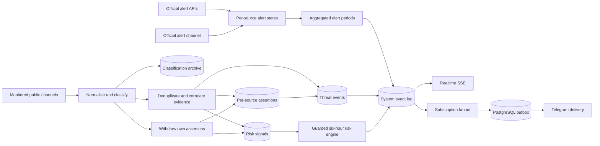
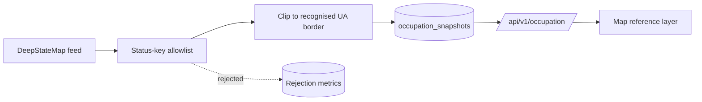

# Architecture

ThreatLens UA is an evidence-processing system, not a strike-prediction system.

## Runtime components

- `app`: Fastify API, static web assets, schedulers, classifier, risk engine, Telegram bot and delivery workers.
- `postgres`: authoritative event store, subscription store, outbox and reporting database.
- `caddy`: public TLS termination, compression and security headers.
- `backup`: daily verified custom-format PostgreSQL archives.

## Information domains

1. **Official alert** — a state aggregated from the configured official alert sources. What makes a
   source official is its designation and tier, not its transport: an alert authority publishing over
   its own Telegram channel is the same authority publishing over HTTPS. AI and OSINT channel
   monitoring still cannot start or end an official alert — only a designated official source can,
   and only for the locations it names.
2. **Threat event** — a normalized public message with time, validity, provenance, geography and evidence level.
3. **Risk assessment** — a six-hour relative index derived from time-decayed signals. It is neither an official alert nor a statistical strike probability.
4. **Occupation layer** — reference context describing which parts of Ukraine are temporarily occupied. It is not an alert, not a threat event and not an input to any risk score.

The fourth domain is deliberately isolated. Occupied-territory geometry never reaches the classifier, the
risk engine, the alert reconciler or the notification fanout; it is stored in its own table
(`occupation_snapshots`), served by its own endpoint (`/api/v1/occupation`) and rendered as its own map
layer. Nothing in the alert or assessment pipeline reads it, and switching the source off with
`OCCUPATION_SOURCE_ENABLED=false` degrades the map to an empty layer without changing any other behaviour.

### Legal framing of the occupation layer

Occupation is a temporary factual condition on the territory of Ukraine. It is not a change of border.
The internationally recognised border of Ukraine remains the authoritative geography of this product,
and the Autonomous Republic of Crimea and the city of Sevastopol are Ukraine. The layer answers
"which Ukrainian territory is currently under occupation", never "where does Ukraine end".

### Fail-safe allowlist

The upstream DeepStateMap feed is an editorial product covering more than the Ukrainian front line. It
also carries polygons for territories russia occupies **outside** Ukraine — twelve of them at the time of
writing: Kaliningrad (`prussia`), Abkhazia, Karelia, Ichkeria, Petsamo, Salla, Estonia, the Pechorsky
district, Latvia, the Kuril Islands, the Tskhinvali district and Transnistria. Rendering the feed as-is
would paint "occupied" polygons across the Baltics, Finland, Georgia, Moldova and Japan on a map that
claims to show Ukraine.

The normalizer is therefore an allowlist, not a blocklist:

- Only status keys on an explicit approved list are ever emitted. Everything else is dropped.
- A **new, unrecognised** status key is dropped as well. It increments
  `threatlens_occupation_unknown_status_keys_total`, is stored in `occupation_snapshots.unknown_status_keys`
  for review, and is never rendered. An upstream vocabulary change makes the layer smaller, never wrong.
- The twelve non-Ukrainian keys are additionally named in `NON_UKRAINIAN_STATUS_KEYS` so the intent is
  documented, testable and visible in the rejection metrics rather than folded into "unknown key".
- Surviving polygons are then clipped to the internationally recognised ADM0 border of Ukraine.

Clipping is the **second** line of defence, not the first. Transnistria is the reason: its polygon overlaps
the Ukrainian border closely enough that a meaningful sliver survives geometric clipping. The allowlist is
what actually keeps it off the map. Any future review must treat the allowlist as the primary control and
the border clip as backup.

### Data licence

DeepStateMap data is not published under an open licence. Attribution is mandatory and is carried in every
`/api/v1/occupation` response. The source is switchable off with a single environment flag. **Open
question:** terms of use for a public deployment have not been agreed with DeepState. The product owner
must obtain explicit permission before a public launch, or run with `OCCUPATION_SOURCE_ENABLED=false`.

### Official sources, and what "official" is not

Two of the official (tier A) sources are APIs — Ukraine Alarm and Alerts.in.ua — and both need a
token issued on written application. The rest are Telegram alert channels, which carry the same
executive-authority and State Emergency Service notifications and need no credential at all: the
national [@air_alert_ua](https://t.me/air_alert_ua) plus the oblast and city military
administrations registered by `migrations/013_source_catalog_expansion.sql`.

Which of those channels is actually read is data, not code. Every row with
`adapter_type='mtproto_alert_channel'` and `enabled=true` is subscribed to and may start and end
alert periods; twenty-one bodies are registered and the rest are switched off. `enabled` on these
rows means one specific thing — **the parser has been shown this channel's published wording, as a
fixture, in `src/domain/alert-parser.test.ts`** — and not "this body is trustworthy", which is what
`tier` and `official` say. Three registered administrations publish real alerts and are switched off
anyway because their format cannot be read safely; `migrations/014_multi_channel_alert_routing.sql`
carries the verbatim samples and the reasoning. `ALERT_CHANNEL_ENABLED` is the deployment-level kill
switch above all of them, the same shape as `OSINT_MONITOR_ENABLED`, and nothing in the application
writes `sources.enabled` for this adapter type.

The distinction that matters is **designation**, not transport. A tier A source designated to publish
alerts starts and ends official alerts whether its bytes arrive over HTTPS or MTProto. What has not
changed, and is not negotiable:

- The AI assessment engine cannot start, end or extend an official alert. It reads them.
- OSINT channel monitoring — the Air Force channel, and anything added beside it — cannot start or
  end an official alert either. It produces threat events and risk signals, which are a different
  information domain with different wording in the UI and the bot.
- A source can only move the alert state of the locations it explicitly names.

The national channel is registered in its own `independence_group` (`official-air-alert-channel`),
separate from `air-force` and from the API group, and each administration carries its own. Note for
anyone reading corroboration counts: the national channel is independent of the *Air Force* channel
in publisher and mandate, but it shares upstream authorities with the civil alert APIs and with the
administrations that feed it, so two-group agreement inside the official family is weaker evidence
than agreement between an official source and an OSINT group. Where two rows are one authority
speaking twice — an administration and the personal channel of the person who heads it — they share
a group so a repost cannot corroborate itself.

### Event-driven official alert source

The APIs return the complete national picture on every poll, so their reconciler is a snapshot: it
clears everything the source held, re-raises what the response reports, and lets the aggregate decide.
A channel is not a snapshot. It publishes transitions — "Повітряна тривога в Нікопольський район",
"Бериславський район - повітряна тривога!" — and a message about one raion says nothing whatsoever
about any other. Running it through the snapshot reconciler would clear the whole country every time
one oblast was mentioned.

It therefore has its own path, in the same module and sharing the same aggregate reconciler:

- 🔴 raises exactly the source-state rows it names; 🟢 lowers exactly the rows it names; every other
  row of that source is untouched.
- **Every function on this path takes its source id from the caller.** `alert_source_states` is keyed
  on `(source_id, location_id, alert_type)`, so several administrations holding an alert over the
  same raion at once is the storage model working as intended: each owns its own row, `bool_or`
  decides what the map shows, and one body's all-clear can never end another body's alert.
- Two published word orders are read, both pinned as verbatim fixtures. The national channel writes
  the phrase first (`🔴 13:47 Повітряна тривога в <район>`, with an optional `•` list); the
  administrations write the location first (`🔴 <район> - повітряна тривога!`) with no printed clock.
- Only "Повітряна тривога" and "Відбій (повітряної) тривоги" move alert state. Other traffic — 🟠
  advisories, 🔴🔴 heightened-danger notices, the "Загроза …"/"Відбій загрози …" family — is recorded
  but never acted on, because "Відбій загрози ударних БпЛА" is a threat standing down inside an alert
  that is still running. In the location-first order the literal "повітрян…" before "тривог…" is
  mandatory: it is what stops "<район> - відбій загрози БпЛА!" from reading as an all-clear now that
  the phrase no longer has to sit at the start of the headline.
- A 🟡 partial all-clear subtracts the locations the same message repeats under "тривога ще триває у"
  (national) or "повітряна тривога досі триває у" (administrations). When nothing survives the
  subtraction, nothing is cleared.
- An administration also publishes ordinary news, and about a third of those posts mention
  "повітряної тривоги" in passing. A message with no status circle **and** no alert phrase in its
  headline is filed as `ignored: 'unrelated'`; anything carrying a circle, or an alert phrase without
  a circle, is still `unrecognized` and logged at warn level. That split is what keeps the
  wording-drift alarm a signal instead of a permanent stream of school-bus announcements.
- `ALERT_END_DEBOUNCE_SECONDS` is **not** inherited. That window exists for polled sources that go
  quiet about an alert they were holding; it is keyed on `alert_source_states.missing_since`, which
  the event path always leaves NULL. An explicit all-clear is a statement, not a silence.
- Message ordering is not trusted. The clock printed in the message body (`12:29`) carries no date and
  no timezone and is never used; the Telegram publication time is. `alert_source_states.last_event_at`
  records the newest message applied to each row and an older event is refused, so an all-clear that
  arrives late after a reconnect cannot take a newer alert off the map.
- An edit is re-processed with the **original** publication time. The corrected text is what matters;
  timing it at the edit would let a correction to an hours-old message restart an alert. A location
  dropped by an edit is not cleared — absence never ends an alert on this path.
- On connect the collector re-reads a bounded window of each channel's history
  (`ALERT_CHANNEL_BACKFILL_MESSAGES`, `ALERT_CHANNEL_BACKFILL_SECONDS`). The window is folded to one
  terminal state per location before anything is written, so an alert that both started and ended
  while the collector was down produces no notification at all — only what is still true now reaches
  the reconciler. The message count is a per-channel *ceiling*: history is read a page at a time and
  the read stops as soon as it runs past the age bound. 300 messages is roughly the six-hour window
  of the busiest channel (~50 messages an hour); an administration publishes one to three an hour and
  finishes in one page, so enabling more channels costs round trips proportional to what each one
  actually published rather than a flat multiple.

The failure mode this model has and the snapshot model does not is a missing all-clear: a 🟢 that is
never delivered, or that arrives in a shape the parser does not recognise, would leave an alert
active forever. `ALERT_CHANNEL_MAX_ALERT_SECONDS` bounds it. The bound is deliberately far longer
than any real alert (default 24 hours, floor 1 hour) because clearing a *live* alert early is the one
failure this system treats as unrecoverable; when it fires it is a defect signal, logged at warn level
and counted in `threatlens_alert_channel_stuck_alerts_total`, not routine behaviour. The sweep covers
**every** alert-channel row, including the ones `enabled=false` switches off: disabling a channel
stops it being read, it does not withdraw what it was holding, and those rows would otherwise pin
their locations on the map with no collector left that could clear them.

Names the channel publishes are raion- and hromada-level and are resolved through the same catalogue
lookup as the API adapters, with its two guarantees intact: LIKE metacharacters are escaped, and an
ambiguous tier is refused rather than resolved to an arbitrary row. A name that resolves to nothing is
a catalogue gap, not a source outage — it is counted and logged, never marked as a source error.

### Threat de-escalation: who still says a threat is happening

A threat event used to fade on one mechanism only — a 30-minute validity timer that every new
observation pushed forward. A channel publishing "ТУшки неактивні, у наш бік наразі нічого не летить"
or "Полтавщина — відбій загрози ударних БпЛА" was recognised, stored and then ignored.

The state model is now the same one the official alert domain already uses. `alert_source_states`
holds one row per (source, location, alert type) and the aggregate is `bool_or(holds)`;
`threat_assertions` holds one row per (event, source, location, threat class) and a threat event
lives while any of its assertions still holds. Having one way to reason about "who still says this
is true" across both domains is the point of the shape.

- **A withdrawal reaches only its own publisher.** Every retraction is `WHERE source_id = <the
  withdrawing source>`, enforced in SQL in one place. One channel — or one joke the classifier reads
  wrongly — can never clear a threat two other channels are still reporting, and a source that never
  asserted matches no rows and therefore changes nothing. That is a consequence of the key, not a
  check that could be forgotten.
- **Scoping is by publisher, not by independence group.** A repost aggregator shares its group with
  the channel it copies (`osint-vanek-nikolaev` / `air-force`), and an all-clear from the copy must
  not retract the original's reporting.
- **`coverage: 'unspecified'`** — a withdrawal that names no place — closes *every* open claim of
  that one source. The classifier deliberately refuses to guess a scope from the text, and no scope
  is invented downstream either; what bounds the blast radius is the publisher, not the wording.
- **A redirect asserts and withdraws in one message.** "Балістика повз Полтаву на Харків" opens a
  claim over the place being approached and closes this source's claim over the place being passed,
  in one transaction. A place the message reports as a *direction* is never withdrawn by it.
- **Validity is never shortened below what the survivors support.** When an assertion is withdrawn,
  `threat_events.valid_until` is recomputed as the maximum over the assertions that still hold, so a
  source taking its claim back cannot cut short a window another source is still vouching for.
- **Risk signals decay; they are never negated.** A withdrawal pulls `risk_signals.expires_at` back
  to now for that source's signals over the same places and classes. A negative contribution could
  drive a location's index to zero while a real threat from other sources is still running; expiry
  says only "the basis for this signal is gone" and leaves the time decay to do the rest. The rows
  stay in place and auditable.
- **Evidence does not move.** An event that loses its last assertion becomes `status='withdrawn'`
  with its `evidence_level` unchanged, and `event_updates` records
  `new_evidence_level = previous_evidence_level`. State and evidence are different axes: a threat two
  independent monitors confirmed remains a confirmed threat in the record after both stood it down.
  A `threat.withdrawn` row is appended to `system_event_log` so the map and SSE see the transition.
- **Nothing here can produce an official all-clear.** No path from the classifier reaches
  `alert_source_states` or `alert_periods`, and the integration suite asserts that directly rather
  than inferring it from the routing code.

### Classification archive

`source_messages` keeps the raw text and one `processing_status` word; everything the classifier
concluded was computed in memory and discarded, so "why was this message ignored?" had no answer.
`message_classifications` now records one row per decision — including the decisions to do nothing —
with the candidate threat classes, the indicators that fired, the resolved locations and their
relation types, the national-scope flag, the resulting event, and, for a withdrawal, what it took
back and what the source last claimed before it.

`classifier_version` (`CLASSIFIER_VERSION` in `src/domain/classifier.ts`) is mandatory on every row
and is the reason the archive is worth keeping. Without it an improvement to this project's own rules
is indistinguishable from a change in enemy behaviour: both look like "fewer ballistic events this
month". Raise it whenever a rule changes what a message means. `UNIQUE (source_message_id,
classifier_version)` makes a replay of the same version a no-op while letting a new version's verdict
land beside the old one, which turns stored history into a golden corpus for regression-testing the
next classifier.

The archive write happens outside the ingestion transaction and its failure is a counter
(`threatlens_classification_log_failures_total`), never an exception. During a mass attack the thing
that must keep working is the map; an analytics row is not worth a dropped threat event.

**Replaying the corpus.** `npm run classifier:replay` reads the archived decisions, classifies the
stored `source_messages` with the rules as they are now, and reports what moved on three axes: the
threat class, the resolved locations, and whether the message raises anything at all. The last one is
split by direction, because "37 messages that used to be ignored now raise an event" and "37 events
that used to be raised are now silent" are opposite findings. `--dry` is the default and writes
nothing; `--write` records the fresh verdicts beside the old ones under the current version, which is
what the `UNIQUE` constraint above was built for. The diff itself lives in
`src/domain/classifier-replay.ts` and is unit-tested without a database, because a broken diff would
report a clean replay for a change that broke everything.

**Shadow classification.** With the `shadow` switch on in `/ops`, a model reads the same message
*after* the deterministic decision has been made and archived, and its verdict is written to
`shadow_classifications` beside the rules' verdict with an `agrees` flag. The call goes through the
one Codex client like every other, so it is audited in `ai_runs` under `shadow-classifier-v1`. It runs
outside the ingestion transaction on a promise nobody waits for, every failure is silence, and there
is no code path by which its answer can reach an event, an alert or the map —
`src/services/shadow-classifier.ts` returns void to the pipeline by design. Its product is a reading
list: `/ops` shows the agreement rate over the last day and the newest disagreements, and the action
that follows is a human writing a pattern and a test. Calls are capped at
`SHADOW_CLASSIFIER_MAX_PER_MINUTE` (default 6) and messages over budget are dropped rather than
queued.

### Attack analytics over the archive

`src/services/attack-analytics.ts` reads the classification archive back out as a public page: for
a day, a week or a month it aggregates means, territories, hours of the day and period-over-period
trends in SQL, clusters messages into waves — with the gap measured between actual message times,
not bucket edges, so the wave count cannot depend on the resolution the reader picked — and writes
a deterministic "patterns and probable strategy" conclusion in the same voice as the narrative
service. `GET /api/v1/analytics/attacks` is public, cached, and validates its period against a
whitelist; the page states plainly that it reads open sources and is neither a forecast nor an
official record. When the previous period is empty the prose says there is no baseline instead of
claiming a comparison it does not have.

### One model client, one audit trail

Everything that reaches a language model goes through `src/services/codex-client.ts`. The client
holds the only copy of the transport decision — the streamed Responses API against
`chatgpt.com/backend-api/codex`, `chat/completions` against anything else, `CODEX_API_STYLE` to
overrule the URL — and the only copy of the audit write: every call, including the pre-flight
refusals that never left the process, lands in `ai_runs` with its prompt, output, duration and
failure reason. The token goes into one `Authorization` header and nowhere else. Which surfaces may
call at all — narrative, nightly digest, vector extrapolation, shadow classification — is stored in
`codex_settings` and switched from `/ops`; every surface is complete without a model, so a dead session degrades to the
deterministic text rather than to an error, and model-written prose is always labelled.

The commitment stated at the top of this document and on the map itself — the system shows an
explicitly reported region, point or direction and never a predicted target, impact or trajectory —
is unchanged. Threat vectors are two different things wearing one name, and the whole design is about
keeping them apart.

**The public chain** is a sequence of *reported observations*: "three sources led this target from
Sumy through Poltava to Kharkiv over eight minutes". It is derived, never stored: every fact it is
made of already lives in `message_classifications` and `message_classification_locations`, so the
chain cannot disagree with the messages it summarises and a classifier fix retroactively corrects
every chain it touched. Each leg is graded by what was actually said, and the payload never flattens
the three rungs into one line:

| Basis | What a single message stated | Where it comes from |
| --- | --- | --- |
| `reported_transit` | the movement itself — "Балістика повз Полтаву на Харків" | a `redirect`: one message retracts the place being passed and asserts the place being approached |
| `reported_direction` | a heading out of a named place, not an arrival | `relation_type='reported_direction'` beside an anchor location |
| `observation_sequence` | **nothing** — two separate messages named two places at two times | consecutive classifications on the same event |

The weakest rung is the one that could be mistaken for a trajectory, so it is labelled as such in the
payload (`basis`, `basisLabel`), drawn as a dotted line rather than a solid one, and described in the
map legend as "порядок наш; рух не стверджувало жодне джерело". Legs whose ends have no coordinate
stay in the payload as stated facts with `drawable: false` — raions carry no KATOTTG coordinate, so
the chain falls back to the centroid of their ADM2 polygon and publishes that as
`coordinateSource: 'raion_centroid'`, `coordinatePrecision: 'approximate'`, rendered as a hollow node.

**The extrapolation** — continue the last leg, name the locations inside the resulting cone, state the
uncertainty — is an operator tool and is isolated the way the occupation layer is isolated, only more
strictly, because this one would be actively harmful if published:

- separate storage: `ops_threat_vector_projections` and `ops_threat_vector_projection_candidates`,
  never a column on `threat_events`, so no `SELECT e.*` in a public query can pick it up;
- separate service (`src/services/vector-projection.ts`) and separate plugin
  (`src/api/ops-vector-routes.ts`) behind the same Basic auth as the rest of `/ops`;
- the import arrow points one way: the ops service imports the public chain builder, and no module
  that builds a public response imports the ops service, at any depth;
- `data_nature` is `CHECK (data_nature = 'calculated')` on the projection row *and* on every candidate
  row, so "this is arithmetic, not an observation" is a property of the data rather than of a caption;
- `confidence` is `CHECK (confidence IN ('low','medium'))`. High confidence in an extrapolation of two
  reported points is not a value this schema can hold.

`src/api/vector-isolation.test.ts` walks the real module graph from every public entry point and
fails the build if any of them reaches the ops modules, and separately fails if the `ops_`-prefixed
table names appear in a public module or in the browser bundle.
`tests/integration/threat-vector.test.ts` plants a marker inside a stored projection and then reads
the snapshot, the threat list and detail, the history, the location timeline, both public vector
endpoints and a live SSE connection including its replay backfill, asserting none of them contains it.

The vector itself is computed deterministically — bearing, ground speed, horizon, cone half-angle,
uncertainty radius and candidate ranking involve no network call. A configured model is offered the
finished numbers and may only return a better Ukrainian phrasing; the reply is schema-validated and
rejected outright if it contains a single number the computation did not produce, and
`narrative_origin` records whether an operator is reading the model's wording or the generated one.

## Event flow

The occupation layer has its own flow and does not join the one above:

## Consistency rules

- Alert sources have independent state rows. A global alert ends only when no configured source still
  **holds** it, and a *polled* source holds an alert while it reports it *and* for
  `ALERT_END_DEBOUNCE_SECONDS` after it stops. A source that publishes an explicit all-clear stops
  holding the alert the moment that all-clear lands; the window is for silence, not for statements.
  Providers are polled every 15 seconds, so a single incomplete response or one failed
  call can no longer produce an "Офіційний відбій"; the alert ends on the first poll after the window
  elapses. The asymmetry is deliberate: a delayed all-clear is recoverable, a false one is not. The
  debounce is an additional condition, not a replacement — one source going quiet still cannot end an
  alert another source is reporting. A provider that stops answering altogether therefore holds its
  alerts open indefinitely; that boundary and its operator response are documented in
  docs/OPERATIONS.md.
- An alert period is unique per (location, alert type, start timestamp). A provider that ends an alert
  and later re-reports it with the identical start timestamp reopens that period instead of inserting a
  colliding one, so one location's history can never abort the snapshot — and therefore the
  reconciliation of every other location in the same poll.
- An event-driven alert source moves only the locations a message explicitly names, and only through
  the two phrases that mean an alert transition. Absence is never an all-clear, an older message never
  overrides a newer one, and a missing all-clear is bounded by `ALERT_CHANNEL_MAX_ALERT_SECONDS`
  rather than left open forever.
- Reposts from the same `independence_group` count as one source.
- Two independent Tier A/B groups may promote an event to `confirmed`.
- Evidence never downgrades when a weaker message is merged into an event.
- A source withdraws only its own assertions. A threat event ends as `withdrawn` when its last
  holding assertion is taken back, and its validity is never shortened below what the remaining
  sources still support. A source that never asserted cannot withdraw anything.
- Withdrawal decays that source's risk signals by expiry, never by a negative contribution, and never
  changes an event's evidence level.
- OSINT withdrawal has no access to official alert state. `alert_source_states` and `alert_periods`
  are unreachable from the classifier path in either direction.
- Every classifier decision is archived with the classifier version that made it, so a change in this
  project's rules stays distinguishable from a change in enemy behaviour.
- Source edits create revisions; a replacement event corrects the previous event instead of silently deleting it.
- Threat events expire after their explicit validity window and remain in history.
- Notification fanout and delivery are separate, idempotent steps.
- City/oblast subscriptions match in both directions through the location hierarchy. The match walks exactly
  one `parent_id` edge, which covers the shipped two-level catalogue (oblast/special city -> city); inserting
  a raion or hromada tier between them would require widening the query.
- The occupation layer is reference context only. It never starts, ends or weights an alert, a threat event
  or a risk assessment.
- A public threat vector contains only reported observations, and every leg names the source, the time
  and how strongly the movement itself was attested. Nothing is continued past the last message.
- The extrapolation of a vector is operator-only and structurally unreachable from public code: its own
  tables, its own service, its own plugin, and no import path from any module that builds a public
  response. Every stored projection row is `data_nature = 'calculated'` by constraint.

## Scale boundary

The initial deployment is intentionally a single application replica because scheduled workers share database cursors. PostgreSQL row locks make outbox delivery safe, but multi-replica scheduler leadership should use advisory locks before horizontal scaling.
