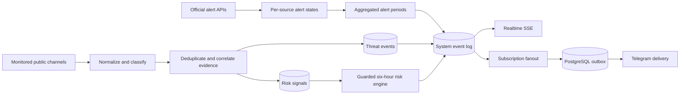
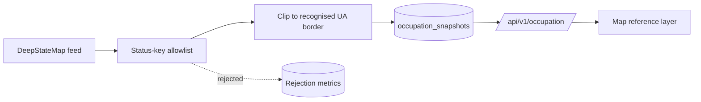

# Architecture

ThreatLens UA is an evidence-processing system, not a strike-prediction system.

## Runtime components

- `app`: Fastify API, static web assets, schedulers, classifier, risk engine, Telegram bot and delivery workers.
- `postgres`: authoritative event store, subscription store, outbox and reporting database.
- `caddy`: public TLS termination, compression and security headers.
- `backup`: daily verified custom-format PostgreSQL archives.

## Information domains

1. **Official alert** — a state aggregated from configured official alert APIs. AI and Telegram monitoring cannot start or end it.
2. **Threat event** — a normalized public message with time, validity, provenance, geography and evidence level.
3. **Risk assessment** — a six-hour relative index derived from time-decayed signals. It is neither an official alert nor a statistical strike probability.
4. **Occupation layer** — reference context describing which parts of Ukraine are temporarily occupied. It is not an alert, not a threat event and not an input to any risk score.

The fourth domain is deliberately isolated. Occupied-territory geometry never reaches the classifier, the
risk engine, the alert reconciler or the notification fanout; it is stored in its own table
(`occupation_snapshots`), served by its own endpoint (`/api/v1/occupation`) and rendered as its own map
layer. Nothing in the alert or assessment pipeline reads it, and switching the source off with
`OCCUPATION_SOURCE_ENABLED=false` degrades the map to an empty layer without changing any other behaviour.

### Legal framing of the occupation layer

Occupation is a temporary factual condition on the territory of Ukraine. It is not a change of border.
The internationally recognised border of Ukraine remains the authoritative geography of this product,
and the Autonomous Republic of Crimea and the city of Sevastopol are Ukraine. The layer answers
"which Ukrainian territory is currently under occupation", never "where does Ukraine end".

### Fail-safe allowlist

The upstream DeepStateMap feed is an editorial product covering more than the Ukrainian front line. It
also carries polygons for territories russia occupies **outside** Ukraine — twelve of them at the time of
writing: Kaliningrad (`prussia`), Abkhazia, Karelia, Ichkeria, Petsamo, Salla, Estonia, the Pechorsky
district, Latvia, the Kuril Islands, the Tskhinvali district and Transnistria. Rendering the feed as-is
would paint "occupied" polygons across the Baltics, Finland, Georgia, Moldova and Japan on a map that
claims to show Ukraine.

The normalizer is therefore an allowlist, not a blocklist:

- Only status keys on an explicit approved list are ever emitted. Everything else is dropped.
- A **new, unrecognised** status key is dropped as well. It increments
  `threatlens_occupation_unknown_status_keys_total`, is stored in `occupation_snapshots.unknown_status_keys`
  for review, and is never rendered. An upstream vocabulary change makes the layer smaller, never wrong.
- The twelve non-Ukrainian keys are additionally named in `NON_UKRAINIAN_STATUS_KEYS` so the intent is
  documented, testable and visible in the rejection metrics rather than folded into "unknown key".
- Surviving polygons are then clipped to the internationally recognised ADM0 border of Ukraine.

Clipping is the **second** line of defence, not the first. Transnistria is the reason: its polygon overlaps
the Ukrainian border closely enough that a meaningful sliver survives geometric clipping. The allowlist is
what actually keeps it off the map. Any future review must treat the allowlist as the primary control and
the border clip as backup.

### Data licence

DeepStateMap data is not published under an open licence. Attribution is mandatory and is carried in every
`/api/v1/occupation` response. The source is switchable off with a single environment flag. **Open
question:** terms of use for a public deployment have not been agreed with DeepState. The product owner
must obtain explicit permission before a public launch, or run with `OCCUPATION_SOURCE_ENABLED=false`.

## Event flow

The occupation layer has its own flow and does not join the one above:

## Consistency rules

- Alert sources have independent state rows. A global alert ends only when no configured source still
  **holds** it, and a source holds an alert while it reports it *and* for `ALERT_END_DEBOUNCE_SECONDS`
  after it stops. Providers are polled every 15 seconds, so a single incomplete response or one failed
  call can no longer produce an "Офіційний відбій"; the alert ends on the first poll after the window
  elapses. The asymmetry is deliberate: a delayed all-clear is recoverable, a false one is not. The
  debounce is an additional condition, not a replacement — one source going quiet still cannot end an
  alert another source is reporting. A provider that stops answering altogether therefore holds its
  alerts open indefinitely; that boundary and its operator response are documented in
  docs/OPERATIONS.md.
- An alert period is unique per (location, alert type, start timestamp). A provider that ends an alert
  and later re-reports it with the identical start timestamp reopens that period instead of inserting a
  colliding one, so one location's history can never abort the snapshot — and therefore the
  reconciliation of every other location in the same poll.
- Reposts from the same `independence_group` count as one source.
- Two independent Tier A/B groups may promote an event to `confirmed`.
- Evidence never downgrades when a weaker message is merged into an event.
- Source edits create revisions; a replacement event corrects the previous event instead of silently deleting it.
- Threat events expire after their explicit validity window and remain in history.
- Notification fanout and delivery are separate, idempotent steps.
- City/oblast subscriptions match in both directions through the location hierarchy. The match walks exactly
  one `parent_id` edge, which covers the shipped two-level catalogue (oblast/special city -> city); inserting
  a raion or hromada tier between them would require widening the query.
- The occupation layer is reference context only. It never starts, ends or weights an alert, a threat event
  or a risk assessment.

## Scale boundary

The initial deployment is intentionally a single application replica because scheduled workers share database cursors. PostgreSQL row locks make outbox delivery safe, but multi-replica scheduler leadership should use advisory locks before horizontal scaling.
